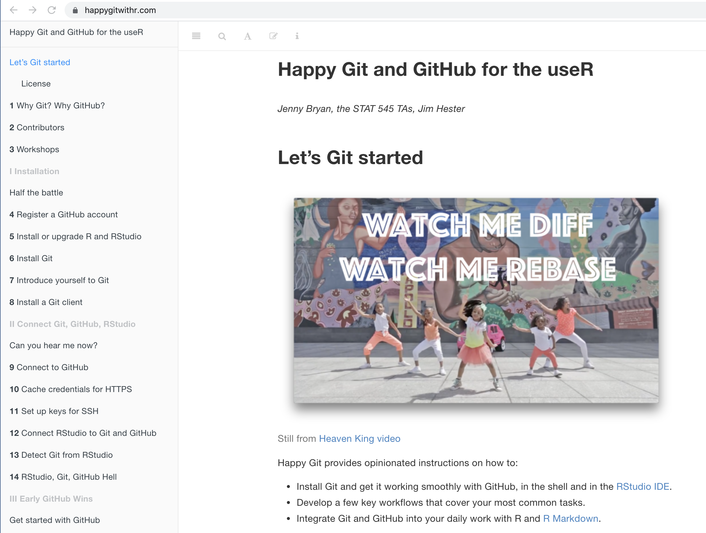
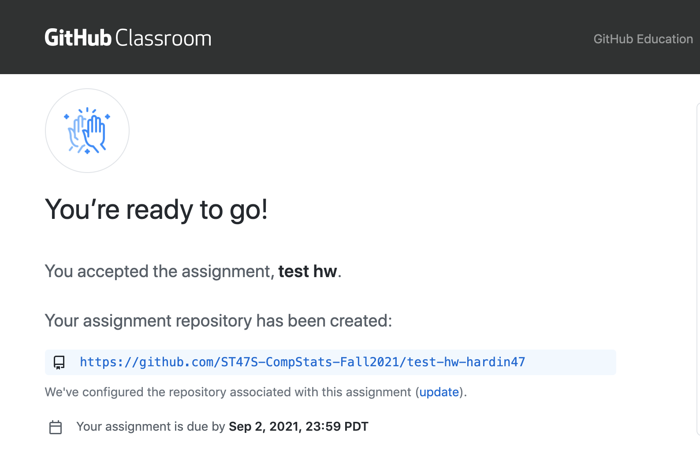
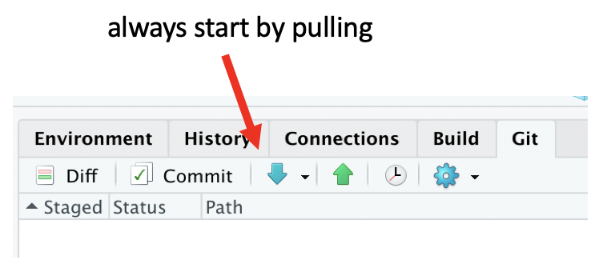
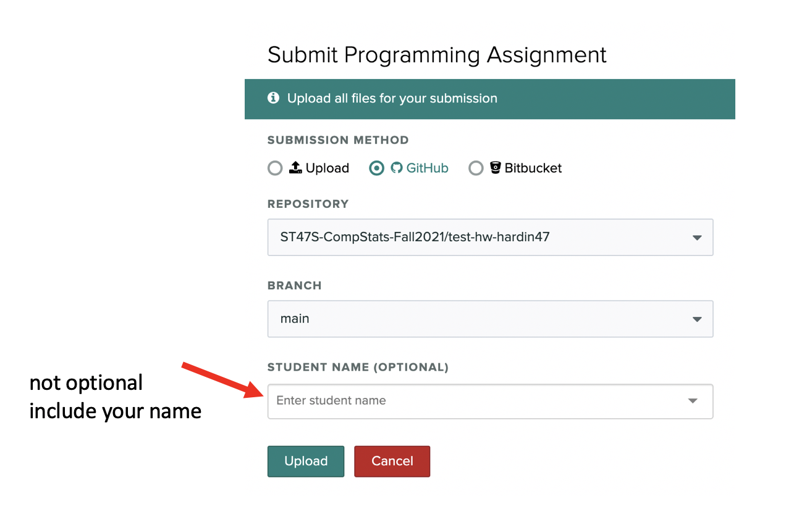

```{r echo = FALSE}
library(tidyverse)
library(kableExtra)
library(knitr)
```

Here's your roadmap for the semester!
Each week, follow the general process outlined below:

- Enjoy the readings <i class="fas fa-book-open"></i>  

- Attend class, review slides <i class="fas fa-desktop" target="_blank"></i> for anything you missed on the agenda  

- Complete the assignment (see Sakai messages for HW link)  

- Discuss the reflection questions <i class="fas fa-lightbulb" target="_blank"></i> and ethics considerations <i class="fas fa-balance-scale"></i> with your classmates, mentor, and professor  


```{r echo = FALSE}
schedule <- tribble(
  ~`date`, ~topic, ~agenda, ~readings, ~slides,
  "1.18.22", 'starting + R + RStudio + Git','$\\boldsymbol{\\cdot}$questionnaire \n $\\boldsymbol{\\cdot}$course info \n $\\boldsymbol{\\cdot}$R + Git \n $\\boldsymbol{\\cdot}$what is a linear model?', 
  '<a href="https://st47s.com/Math158/Notes/intro.html"><i class="fas fa-book-open"></i></a>Introduction \n <a href="https://m58-intro-stats.netlify.app/github.html"><i class="fas fa-book-open"></i></a>Git',
  '<a href="posts/2021-08-31-getting-started/#slides"><i class="fas fa-desktop"></i></a>')
```


```{r eval = FALSE, include = FASLE}
  "9.7.21", '<a href="posts/2021-09-07-dataviz/">data viz</a>',
  '<a href="posts/2021-09-07-dataviz/#readings"><i class="fas fa-book-open" target="_blank"></i></a>',
  '<a href="posts/2021-09-07-dataviz/#reflection-questions"><i class="fas fa-lightbulb" target="_blank"></i></a>',
  '<a href="posts/2021-09-07-dataviz/#ethics-considerations"><i class="fas fa-balance-scale" target="_blank"></i></a>',
  '<a href="posts/2021-09-07-dataviz/#slides"><i class="fas fa-desktop" target="_blank"></i></a>',
  '<a href="posts/2021-09-07-dataviz/#additional-resources"><i class="fas fa-laptop"></i></a>',
  "9.14.21", '<a href="posts/2021-09-14-wrangling/">wrangling</a>',
  '<a href="posts/2021-09-14-wrangling/#readings"><i class="fas fa-book-open" target="_blank"></i></a>',
  '<a href="posts/2021-09-14-wrangling/#reflection-questions"><i class="fas fa-lightbulb" target="_blank"></i></a>',
  '<a href="posts/2021-09-14-wrangling/#ethics-considerations"><i class="fas fa-balance-scale" target="_blank"></i></a>',
  '<a href="posts/2021-09-14-wrangling/#slides"><i class="fas fa-desktop" target="_blank"></i></a>',
  '<a href="posts/2021-09-14-wrangling/#additional-resources"><i class="fas fa-laptop"></i></a>',
  "9.21.21", '<a href="posts/2021-09-21-simulating/">simulating</a>',
  '<a href="posts/2021-09-21-simulating/#readings"><i class="fas fa-book-open" target="_blank"></i></a>',
  '<a href="posts/2021-09-21-simulating/#reflection-questions"><i class="fas fa-lightbulb" target="_blank"></i></a>',
  '<a href="posts/2021-09-21-simulating/#ethics-considerations"><i class="fas fa-balance-scale" target="_blank"></i></a>',
  '<a href="posts/2021-09-21-simulating/#slides"><i class="fas fa-desktop" target="_blank"></i></a>',
  '<a href="posts/2021-09-21-simulating/#additional-resources"><i class="fas fa-laptop"></i></a>',
  "9.28.21", '<a href="posts/2021-09-28-permutation/">permutation tests</a>',
  '<a href="posts/2021-09-28-permutation/#readings"><i class="fas fa-book-open" target="_blank"></i></a>',
  '<a href="posts/2021-09-28-permutation/#reflection-questions"><i class="fas fa-lightbulb" target="_blank"></i></a>',
  '<a href="posts/2021-09-28-permutation/#ethics-considerations"><i class="fas fa-balance-scale" target="_blank"></i></a>',
  '<a href="posts/2021-09-28-permutation/#slides"><i class="fas fa-desktop" target="_blank"></i></a>',
  '<a href="posts/2021-09-28-permutation/#additional-resources"><i class="fas fa-laptop"></i></a>',
  "10.5.21", '<a href="posts/2021-10-05-bootstrap/">bootstrapping</a>',
  '<a href="posts/2021-10-05-bootstrap/#readings"><i class="fas fa-book-open" target="_blank"></i></a>',
  '<a href="posts/2021-10-05-bootstrap/#reflection-questions"><i class="fas fa-lightbulb" target="_blank"></i></a>',
  '<a href="posts/2021-10-05-bootstrap/#ethics-considerations"><i class="fas fa-balance-scale" target="_blank"></i></a>',
  '<a href="posts/2021-10-05-bootstrap/#slides"><i class="fas fa-desktop" target="_blank"></i></a>',
  '<a href="posts/2021-10-05-bootstrap/#additional-resources"><i class="fas fa-laptop"></i></a>',
  '<font color = "#114B5F"><b>10.12.21</b></font>',
'<a href="posts/2021-10-12-review1/"><font color = "#114B5F"><b>catch-up + exam</b></font></a>',
  '<a href="posts/2021-10-12-review1/#readings"><i class="fas fa-book-open" target="_blank"></i></a>',
  '<a href="posts/2021-10-12-review1/#reflection-questions"><i class="fas fa-lightbulb" target="_blank"></i></a>',
  '<a href="posts/2021-10-12-review1/#ethics-considerations"><i class="fas fa-balance-scale" target="_blank"></i></a>',
  '<a href="posts/2021-10-12-review1/#slides"><i class="fas fa-desktop" target="_blank"></i></a>',
  '<a href="posts/2021-10-12-review1/#additional-resources"><i class="fas fa-laptop"></i></a>',
  '<font color = "#114B5F"><b>10.14 + 15.21</b></font>', '<font color = "#114B5F"><b>Exam 1</b></font>', "","","","","", 
  "10.19.21", '<a href="posts/2021-10-21-recipes/">recipes</a>',
  '<a href="posts/2021-10-21-recipes/#readings"><i class="fas fa-book-open" target="_blank"></i></a>',
  '<a href="posts/2021-10-21-recipes/#reflection-questions"><i class="fas fa-lightbulb" target="_blank"></i></a>',
  '<a href="posts/2021-10-21-recipes/#ethics-considerations"><i class="fas fa-balance-scale" target="_blank"></i></a>',
  '<a href="posts/2021-10-21-recipes/#slides"><i class="fas fa-desktop" target="_blank"></i></a>',
  '<a href="posts/2021-10-21-recipes/#additional-resources"><i class="fas fa-laptop"></i></a>',
  '<font color = "#114B5F"><b>10.24.21</b></font>', '<font color = "#114B5F"><b>Take home 1</b></font>', "","","","","",
 "10.26.21", '<a href="posts/2021-10-26-knn-trees/">knn + trees</a>',
  '<a href="posts/2021-10-26-knn-trees/#readings"><i class="fas fa-book-open" target="_blank"></i></a>',
  '<a href="posts/2021-10-26-knn-trees/#reflection-questions"><i class="fas fa-lightbulb" target="_blank"></i></a>',
  '<a href="posts/2021-10-26-knn-trees/#ethics-considerations"><i class="fas fa-balance-scale" target="_blank"></i></a>',
  '<a href="posts/2021-10-26-knn-trees/#slides"><i class="fas fa-desktop" target="_blank"></i></a>',
  '<a href="posts/2021-10-26-knn-trees/#additional-resources"><i class="fas fa-laptop"></i></a>',
  '<font color = "#114B5F"><b>10.26.21</b></font>', '<a href = "https://m154-comp-stats.netlify.app/project.html"><font color = "#114B5F"><b>Initial Project Proposal</b></font></a>', "","","","","",
 "11.2.21", '<a href="posts/2021-11-02-rf/">bagging + RF</a>',
  '<a href="posts/2021-11-02-rf/#readings"><i class="fas fa-book-open" target="_blank"></i></a>',
  '<a href="posts/2021-11-02-rf/#reflection-questions"><i class="fas fa-lightbulb" target="_blank"></i></a>',
  '<a href="posts/2021-11-02-rf/#ethics-considerations"><i class="fas fa-balance-scale" target="_blank"></i></a>',
  '<a href="posts/2021-11-02-rf/#slides"><i class="fas fa-desktop" target="_blank"></i></a>',
  '<a href="posts/2021-11-02-rf/#additional-resources"><i class="fas fa-laptop"></i></a>',
  '<font color = "#114B5F"><b>11.2.21</b></font>', '<a href = "https://m154-comp-stats.netlify.app/project.html"><font color = "#114B5F"><b>Final Project Proposal</b></font></a>', "","","","","",
 "11.9.21", '<a href="posts/2021-11-09-svm/">support vector machines</a>',
  '<a href="posts/2021-11-09-svm/#readings"><i class="fas fa-book-open" target="_blank"></i></a>',
  '<a href="posts/2021-11-09-svm/#reflection-questions"><i class="fas fa-lightbulb" target="_blank"></i></a>',
  '<a href="posts/2021-11-09-svm/#ethics-considerations"><i class="fas fa-balance-scale" target="_blank"></i></a>',
  '<a href="posts/2021-11-09-svm/#slides"><i class="fas fa-desktop" target="_blank"></i></a>',
  '<a href="posts/2021-11-09-svm/#additional-resources"><i class="fas fa-laptop"></i></a>',
  '<font color = "#114B5F"><b>11.18.21</b></font>', '<font color = "#114B5F"><b>Data-ing in the World</b></font>', "","","","","",
"11.18.21", '<a href="posts/2021-11-18-clustering/">clustering</a>',
  '<a href="posts/2021-11-18-clustering/#readings"><i class="fas fa-book-open" target="_blank"></i></a>',
  '<a href="posts/2021-11-18-clustering/#reflection-questions"><i class="fas fa-lightbulb" target="_blank"></i></a>',
  '<a href="posts/2021-11-18-clustering/#ethics-considerations"><i class="fas fa-balance-scale" target="_blank"></i></a>',
  '<a href="posts/2021-11-18-clustering/#slides"><i class="fas fa-desktop" target="_blank"></i></a>',
  '<a href="posts/2021-11-18-clustering/#additional-resources"><i class="fas fa-laptop"></i></a>',
  '<font color = "#114B5F"><b>11.19.21</b></font>', '<a href = "https://m154-comp-stats.netlify.app/project.html"><font color = "#114B5F"><b>Project Update</b></font></a>', "","","","","",
"11.23.21", '<a href="posts/2021-11-18-clustering/">clustering</a>',
  '<a href="posts/2021-11-18-clustering/#readings"><i class="fas fa-book-open" target="_blank"></i></a>', 
  '<a href="posts/2021-11-18-clustering/#reflection-questions"><i class="fas fa-lightbulb" target="_blank"></i></a>',
  '<a href="posts/2021-11-18-clustering/#ethics-considerations"><i class="fas fa-balance-scale" target="_blank"></i></a>',
  '<a href="posts/2021-11-18-clustering/#slides"><i class="fas fa-desktop" target="_blank"></i></a>',
  '<a href="posts/2021-11-18-clustering/#additional-resources"><i class="fas fa-laptop"></i></a>',
  '<font color = "#114B5F"><b>11.30.21</b></font>',
'<a href="posts/2021-11-30-review2/"><font color = "#114B5F"><b>catch-up + exam</b></font></a>',
  '<a href="posts/2021-11-30-review2/#readings"><i class="fas fa-book-open" target="_blank"></i></a>',
  '<a href="posts/2021-11-30-review2/#reflection-questions"><i class="fas fa-lightbulb" target="_blank"></i></a>',
  '<a href="posts/2021-11-30-review2/#ethics-considerations"><i class="fas fa-balance-scale" target="_blank"></i></a>',
  '<a href="posts/2021-11-30-review2/#slides"><i class="fas fa-desktop" target="_blank"></i></a>',
  '<a href="posts/2021-11-30-review2/#additional-resources"><i class="fas fa-laptop"></i></a>',
  '<font color = "#114B5F"><b>11.30.21</b></font>', '<font color = "#114B5F"><b>Take home 2</b></font>', "","","","","",
  '<font color = "#114B5F"><b>12.2 + 3.21</b></font>', '<font color = "#114B5F"><b>Exam 2</b></font>', "","","","","",
 "12.7.21", '<a href="posts/2021-12-07-extensions/">fantastic extensions</a>',
  '<a href="posts/2021-12-07-extensions/#readings"><i class="fas fa-book-open" target="_blank"></i></a>',
  '<a href="posts/2021-12-07-extensions/#reflection-questions"><i class="fas fa-lightbulb" target="_blank"></i></a>',
  '<a href="posts/2021-12-07-extensions/#ethics-considerations"><i class="fas fa-balance-scale" target="_blank"></i></a>',
  '<a href="posts/2021-12-07-extensions/#slides"><i class="fas fa-desktop" target="_blank"></i></a>',
  '<a href="posts/2021-12-07-extensions/#additional-resources"><i class="fas fa-laptop"></i></a>',
  '<font color = "#114B5F"><b>12.10 + 14.21</b></font>', '<a href = "https://m154-comp-stats.netlify.app/project.html"><font color = "#114B5F"><b>Group Presentations</b></font></a>', "","","","","",
  '<font color = "#114B5F"><b>12.14.21</b></font>', '<a href = "https://m154-comp-stats.netlify.app/project.html"><font color = "#114B5F"><b>Final write-up</b></font></a>', "","","","","")
```


```{r echo = FALSE}
schedule %>% 
  kbl(escape = FALSE, align = c(rep('l',2), rep('c',5))) %>%
  kable_styling(bootstrap_options = c("striped", "hover")) %>%
  column_spec(4, )
```


<!--chapter:end:index.Rmd-->

---
title: "About this blog"
description: |
  Some additional details about the blog
---

```{r setup, include=FALSE}
knitr::opts_chunk$set(echo = FALSE)
```

<!--chapter:end:about.Rmd-->

---
title: "Working on assignments with GitHub and Gradescope"
description: |
  Huge thanks to Ben Wiedermann at HMC for sharing the following.  
author:
  - name: Jo Hardin 
    url: https://m154-comp-stats.netlify.app/
    affiliation: Pomona College
    affiliation_url: https://hardin47.netlify.app/
  - name: original content by Ben Wiedermann
    affiliation: Harvey Mudd College
output: 
  distill::distill_article:
    toc: true
    toc_depth: 1
---

```{r setup, include=FALSE}
knitr::opts_chunk$set(echo = TRUE, message = FALSE, 
                      warning = FALSE, cache = TRUE,
                      fig.width=10, eval.after = 'fig.cap')
library(tidyverse)
library(infer)
library(broom)
library(tidymodels)
library(knitr)
library(viridis)
library(patchwork)

library(praise)
set.seed(4747)
```

# Working on assignments with GitHub and Gradescope


In Math 154, we will use GitHub + Gradescope to access and submit assignments.  Here is the basic structure of how it will work:

1. Get the assignment materials from GitHub classroom.
2. Clone the repository to any machine you are using.
3. Work on the assignment and push back to GitHub.
4. Submit the assignment on Gradescope.

<aside>
```{r echo = FALSE, fig.cap="image credit: xkcd", fig.alt = "xkcd comic detailing that Git can be pretty complicated."}
include_graphics("images/git_2x.png")
```
</aside>

The following diagram lays out the process, and the rest of the document provides a more detailed set of instructions.

```{r echo = FALSE, fig.cap="Flowchart of assignment process.", fig.alt = "Flowchart demonstrating that assignments are recieved from Git, processed on your computer (iteratively with GitHub), and submitted to Gradescope."}

```

# Installing R + RStudio + Git

Most importantly, please become familiar with [Happy Git and GitHub with R](https://happygitwithr.com/).  Happy Git with R is an incredibly user friendly resource which includes help for almost every single thing that might happen when getting started.  

<aside>
[Happy Git with R](https://happygitwithr.com/) is your new best friend.
</aside>

1. The first step is to install R + RStudio + Git on your machine.  (If you are planning to use Pomona's RStudio server, R + RStudio + Git are all three already installed for you.)

2. Create an account on GitHub (if you already have one, use it!).

3. Introduce everyone:  R + RStudio (should happen automatically); yourself to GitHub (see https://happygitwithr.com/); RStudio + GitHub (see https://happygitwithr.com/).

4. Follow the rest of the steps that Jenny Bryan spells out in [Happy Git and GitHub with R](https://happygitwithr.com/).  Most likely, you only need to work through step 12.  Step 15 is detailed below after you have gotten the assignment from GitHub.

```{r echo = FALSE, fig.cap="The more you read Happy Git with R, the better your life will be.", fig.alt = "Screen shot of the Happy Git with R webpage."}

```

# Get the assignment materials from GitHub Classroom

Each assignment will be provided as a link to GitHub classroom. Click the link.  (The link will come to you via an email from Sakai.  If you lose the email, or the email goes to your spam folder, check Sakai messages for the assignment link.)

<aside>
When you use GitHub classroom for the first time, you'll be asked to authorize GitHub classroom to access your repositories.
</aside>

The first assignment will be an individual assignment.
Some other assignments will be paired or group assignments.
To accept an individual assignment, click the “Accept this assignment” button.

For all **joint** assignments, you will need to create a team before you can start.

* If you are working with a partner, create a team name that contains both of your GitHub ids. (If you are working by yourself, use your GitHub id as your team name.)
* One partner accepts the assignment and creates the team.
* If you are working with a partner, the person who did *not* create the team and accept the assignment should now click the GitHub classroom link, find the newly created team, and click the Join button.

<aside>
&#9888; You may need to add a description of the assignment (for example “Lab 2”) to team name. This is because GitHub Classroom does seem to make it easy for some people to work in the same group as a previous assignment while other people form new groups.
</aside>

```{r echo = FALSE, fig.cap="Accept the assignment to create a different repository for every assignment.", fig.alt = "Screen shot of GitHub showing where to accept the assignment."}
include_graphics("images/accept-assignment.png")
```

The assignment files will be copied as a private repository that you (and your partner, if applicable) and the course staff have access to.

We will call this version, that lives on your personal GitHub account the *GitHub fork*.


# Clone the assignment (or project) repository on to your own computer(s)

Once your repository has been created, you should clone the code to whatever computer you are working on.  Just like a Google Doc, you can work on the files from different machines at different times.  Unlike a Google Doc, you'll have to make sure to open the repo (`clone` or `pull` if you've aleady `clone`d) and save the repo (`commit` + `push`) more deliberately.

<aside>
[Happy Git with R](https://happygitwithr.com/) is your new best friend.
</aside>

1. Click on the link for the repository.

```{r echo = FALSE, fig.cap="Clink on the link to your assignment repository to get started.", fig.alt = "Screen shot of GitHub showing the new assignment repo."}

```

2. Click the `Clone or download` button and copy the URL.

```{r echo = FALSE, fig.cap="Copy the HTTPS URL, and use it to create a new project in RStudio.", fig.alt = "Screen shot of GitHub showing the location of the repo URL."}
include_graphics("images/repo-clone.png")
```

3. On the cloning machine (e.g., your own compute or the RStudio server), create a new R project with the URL copied from above.  Follow the steps at https://happygitwithr.com/new-github-first.html (section 15.2 New RStudio Project via git clone).


# Work on the assignment, push back to GitHub

<aside>
&#9888; Always start your work session with a pull to the computer you are working on, and end your session with a push back to GitHub.
</aside>

All of the GitHub interaction will take place through the RStudio IDE.  The two important steps for getting the assignment back to GitHub are:

## `pull`

If you are working with a colleague or on different machines it is so incredibly important to get in the habit of immediately clicking on `pull` when you start your work.  (If you are working alone on a single machine `pull` won't hurt!  You'll just be told that your files are already up to date.)


```{r echo = FALSE, fig.cap="Always pull before you start. pull-work-save-commit-push", fig.alt = "Screen shot of how to pull using the Rstudio IDE."}

```

## `knit` your work

Don't forget to put your name on the assignment.  Also, make sure that you knit to pdf.  Knit early and often.  The more often you knit, the fewer headaches you will have.

```{r echo = FALSE, fig.cap="Always pull before you start. pull-work-knit-commit-push", fig.alt = "Screen shot of how to knit using the RStudio IDE."}

```

## `commit` your work

You don't need to commit every file, but you do need to commit files that are integral to the analysis (always commite .Rmd, .pdf, data files, images that created the pdf, etc.).

```{r echo = FALSE, fig.cap="pull-work-knit-commit-push", fig.alt = "Screen shot of how to commit using the RStudio IDE."}

```

## `push` your work to GitHub

It is good practice to use meaningful commit messages to help your future self figure out your past work.

```{r echo = FALSE, fig.cap="pull-work-knit-commit-push", fig.alt = "Screen shot of how to push using the RStudio IDE."}

```

## check your work on GitHub

To make sure that the work went through, always check your GitHub repo online to confirm any changes you made.

```{r echo = FALSE, fig.cap="Check that your changes are correct.", fig.alt = "Screen shot of checking GitHub changes online."}
include_graphics("images/check-github.png")
```

# Submit the assignment on Gradescope

You will submit your assignments via Gradescope.
To submit your assignment, complete the following steps:

<aside>
The first time you submit, you may need to click "Connect to GitHub", to connect your Gradescope account to your GitHub account.
</aside>

1. Access the course’s Gradescope site, select the appropriate assignment, and then choose GitHub as the submission method.  You must access the course's Gradescope site via the side menu in Sakai.

```{r echo = FALSE, fig.cap="Access Gradescope via Sakai.", fig.alt = "Screen shot of Gradescope connection from inside Sakai."}

``` 

2. The first time you submit your repository, you will need to authorize Gradescope to access your git repository. Select the appropriate repository and branch (brank will almost always be `main`).

```{r echo = FALSE, fig.cap="Submit files directly from GitHub.", fig.alt = "Screen shot of Gradescope instruction to submit via GitHub."}

``` 

3. If this is a pair-programming submission, you will need to associate all team members with the submission. After you upload your files, click "Add Group Member" and add your partner to the submission. Add your team member to your Gradescope submission

You can submit multiple times before the deadline. Your last submission will determine your grade.

Once assignments are completely graded, you will be able to see your grade and assignment feedback on Gradescope. Grades will also be synched with Sakai.

<!--chapter:end:github.Rmd-->

---
title: "Class Notes"
description: |
  Daily class notes for Math 158, Linear Models, Pomona College
author:
  - name: Jo Hardin 
    url: https://m158-lin-mod.netlify.app/
    affiliation: Pomona College
    affiliation_url: https://hardin47.netlify.app/
output: distill::distill_article
---


Class notes can be found at <a href="http://st47s.com/Math158/Notes/" target="_blank">http://st47s.com/Math158/Notes/</a>.

<p>   </p>

```{r layout="l-page", out.extra='style="border: none;"', echo = FALSE}
knitr::include_url("https://st47s.com/Math158/Notes/")
```


<!--chapter:end:notes.Rmd-->

---
title: "Semester Project"
description: |
  The best part of the semester: the awesome data-based group project!
output: distill::distill_article
---

```{r setup, include=FALSE}
knitr::opts_chunk$set(echo = FALSE)
```

```{r fig.cap = "Artwork by @allison_horst.", fig.alt = "Two monsters working magic to come up with a complete data analysis and presentation.", preview = TRUE, echo = FALSE}
knitr::include_graphics("images/project.png")
```

# Project Instructions

You will undertake a computational statistics project on a topic of your choice focused on a **dataset**. The project is an opportunity to show off what you've learned about the entire process of running a computational statistics analysis. It is a major component of the class, and successful completion is required to pass. Your final output for this project will be:

1. a technical report written in R Markdown, compiled to pdf  
2. an oral presentation delivered to the class

## Group Formation

You will work in a group of (approximately) three students. You may choose your own groups, or I would be happy to assign you to a group. The best groups will have team members with similar interests as far as application areas (e.g., biology, economics, etc.) but differing abilities and interests in terms of computational statistics (e.g., a stronger programmer combined with a visualization designer combined with a domain knowledge expert). See <a href = "https://m154-comp-stats.netlify.app/roles.html" target="_blank">Group Roles</a> for more information on allocating tasks.

## Assignment

Your task is to use data to tell us something interesting. This project is deliberately open-ended to allow you to fully explore your creativity. There are three main rules that must be followed:

1. Your project must be centered around data. Preferably, you will work with large, complex, and/or messy data. The more challenging your data set is, the better. Two things that will make your project more ambitious (and more interesting) are:  
   * Combining two or more data sets that are not obviously related. For example, in the tweets predicting elections paper from the first day of class, the researchers had to combine data from Twitter that had nothing to do with politics with a data set of congressional districts, and both data sets had to be spatially-aware, since the merging was done according to the geographical location of the tweet.  
   * Accessing a live data stream. There are many APIs on the Internet that allow you to access data that changes on a continual basis. This is in contrast to static data that was collected at some point in time and does not change. If your project can respond dynamically to a live data stream, then this will make it more interesting.  
Please note that neither of the above stipulations are requirements – they are merely examples of two considerations that may make your data more challenging to work with – and thus your project more ambitious.

2. Your project must tell us something. We've seen a range of projects / analyses over the course of the semester. On one extreme are visualization projects (like Snow's cholera map) that involve virtually no statistical analysis. On the other extreme are data mining projects like the KDD cup or Kaggle competitions, which involve very little visualization. Your project can be anywhere on this spectrum, but expectations may be different depending on where you are on the scale. An example of a project that doesn't tell us anything, would be something that downloads a single data source and summarizes it, with some perfunctory visualization. Make sure that your project is thought-provoking and has some underlying meaning!

3. To get an A, you must show something beyond what we've done in class. Some examples:
Use a new data mining technique (e.g., an artificial neural network, näive Bayes classifier)
Use a new programming technology (e.g., Python, MapReduce, shell scripting...  should be new to you!)  
   * Use a new visualization technology (e.g., Inkscape, Illustrator, Shiny, Processing)  
   * Use a new live data source or API (e.g., Flickr, Facebook, <a href = "https://github.com/amrrs/coinmarketcapr" target = "_blank">CoinMarketCap</a>) [Note: just downloading a new data set in a flat file does not count!]  
   * Use a new data format (e.g., XML, HDF5, JSON)  
   * Compare two datasets (e.g., <a href = "https://github.com/rundel/Dennys_LaQuinta_Chance" target = "_blank">La Quinta vs. Dennys</a>!)   
Also, domain knowledge does not count here, so your outside knowledge of protein folding makes for a great motivation, but it doesn't count as something extra.

4. At some point in the project, you should give an analysis/discussion of where the data came from and what/who it represents.

5. Last, you must address any ethical considerations that came about during the project.  How were you or weren't you able to address the ethical issues that came up?    
In addition to the examples you have seen over the course of the semester (and previous project links given at the bottom of this page), here are some generic ideas:  

   * Compete (strongly) in a past KDD cup or Kaggle competition    
   * Create a GoogleMaps mash-up  
   * Write an `R` package that provides an API to an online data set  
   * Create a Shiny application that helps a Pomona professor analyze their data  


### General Rules

You may discuss your project with other students, but each group will have a different topic, so there is a limit to how much you can help each other. You may consult other sources, and you should **credit all sources** in your report. Feel free to consult with me or your mentors.


# Components

## Proposals

Your initial proposal (via email to me) is due by midnight on Tuesday, October 26th. The final proposal (via GitHub project site) will be due the following week on November 2nd.

Prior to writing your initial proposal you should get together with your group-mates and brainstorm a half dozen or so ideas before coalescing around one idea. Be ambitious! Once you decide on a topic that interests you, think about what you would like to end up with as a final result – without worrying about how to get there. Try to visualize what your end product will look like. Will it be an interactive map? A predictive model? A mobile application? Don't think about coding, or a particular data set, or what you know how to do now. If you come up with something ambitious and original, you'll be more motivated to learn new things as you go in order to accomplish your goal.

The topic is completely open to your choice, but keep in mind the three main rules listed above. Try to think about how you will satisfy the criteria.

### Content

Your initial (via email) and revised (via GitHub) proposals should contain the following content:

1. Group Members: List the members of your group. For the revised proposal, add additional information about each person's role. Each member of the group should have two jobs: (1) a group dynamic role, (2) a project role. See <a href = "https://m154-comp-stats.netlify.app/roles.html" target="_blank">Group Roles</a> for more information on allocating tasks.

2. Title: The title of your project

3. Purpose: Describe the general topic/phenomenon you want to explore, as well some carefully considered questions that you hope to address. You should make an argument motivating your work. Why should someone be interested in what you are doing? What do you hope people will learn from your project?

4. Data: As best you can, describe where you will find your data, and what kind of data it is. Will you be working with spatial data in shapefiles? Do the data come from json files?  Will you be accessing an API to a live data source? Be as specific as you can, listing URLs and file formats if possible.

5. Variables: As much as possible, list, and briefly describe, each variable that you plan to incorporate. If you can, be specific about units, scale, etc.

6. End Product: Describe what you hope to deliver as a final product. Will it be a Shiny application that will be posted on the Internet? Will it be a GoogleMaps mash-up? Will it be a package that provides an API to a live data source (e.g., twitteR)? Will it be a method that draws some statistical conclusions? Will it be a predictive model that forecasts future values of some quantity?


## Update

Please respond to the following three questions (posted to your GitHub repo) by the end of the day Friday, November 19th.

1. Have you already collected, or do you have access to, all of the data that you will need in order to complete your project? If not, please estimate the percentage of the data that you have, describe any issues that you are having, and what your plan is for getting the rest of the data.

2. What is the single biggest unresolved issue you are having? Please describe it briefly, and what your plan is for resolving this issue.

3. What are the elements from outside of the course, if any, that you plan to incorporate into your project?


## Presentation

An effective oral presentation is an integral part of this project. One of the objectives of this class is to give you experience conveying the results of a technical investigation to a non-technical audience in a way that they can understand. Whether you choose to stay in academia or pursue a career in industry, the ability to communicate clearly is of paramount importance. As a statistician (data scientist, software engineer, etc.), the burden of proof is on you to convince your audience that what you are saying is true. If your audience (who may very well be less knowledgeable about statistics than you are) cannot understand your results or their interpretations, then the technical merit of your project is irrelevant.

On Friday/Tuesday, December 10/14th, your group will make a 10-12 minute oral presentation to the class. You should make (good) slides. Your goal should be to convey to your audience a clear understanding of your research topic, along with a basic understanding of your project, and how well it addresses the research question you posed. You should **not** tell us everything that you did, or show a bunch of things that you tried that didn't work well. After hearing your talk, each student in the class should be able to answer:

1. What was your project about?  
2. What format was the original data in, and what [downloading, data wrangling, data analysis] techniques did you apply to it?  
3. What were your findings?

You should prepare electronic slides for your talk. PowerPoint is fine, but you might also want to consider Markdown slides (<a href = "http://rmarkdown.rstudio.com/ioslides_presentation_format.html" target = "_blank">ioslides</a>, <a href = "http://rmarkdown.rstudio.com/slidy_presentation_format.html" target = "_blank">Slidy</a>, or <a href = "http://rmarkdown.rstudio.com/revealjs_presentation_format.html" target = "_blank">reveal.js</a>), Google Presentation, Beamer (LaTeX), or alternative, non-linear presentation software like <a href = "http://prezi.com/" target = "_blank">Prezi</a>. Use your creativity! One thing you should not do is walk us through your calculations in R Studio. If your project has any interactive elements, please demonstrate them for us!

You will need to email me and submit your slides to GitHub before your presentation, and as a back-up ideally the presentation will also live in the cloud somewhere. You should plan to **not** hook up your laptop to the computer in Millikan 1021 (unless you have good reason and have spoken to me about it beforehand).

### Advice

There are many sources of advice for how to make a good presentation, but an excellent place to start is a project called <a href = "http://techspeaking.denison.edu/" target = "_blank">Technically Speaking</a>.

Watch the videos on this site to identify some common mistakes. Here is some general advice:

   * Budget your time. You only have ~10 minutes, and we will be running a tight schedule. Plan for 8-10 minutes to talk, and 2 minutes to answer questions. If your talk runs too short or too long, it makes you seem unprepared. Rehearse your talk ahead of time (with your group) several times in order to get a better feel for your timing. Note also that you may have a tendency to talk faster during your actual talk than you will during your rehearsal. Talking faster in order to speed up is not a good strategy – you are much better off simply cutting material ahead of time.  
   * Don't write too much on each slide. You don't want people to have to read your slides, because if the audience is reading your slides, then they aren't listening to you. You want your slides to provide visual cues to the points that you are making – not substitute for your spoken words. Concentrate on graphical displays and bullet-pointed lists of ideas (not sentences).  
   * Put your problem in context. Remember that most of your audience will have little or no knowledge of your subject matter. The easiest way to lose people is to dive right into technical details that require prior domain knowledge. Spend a few minutes at the beginning of your talk introducing your audience to the most basic aspects of your topic and present some motivation for what you are studying.  
   * Speak loudly and clearly. Remember that you know more about your topic that anyone else in the room, so speak and act with confidence!  
   * Tell a story – not necessarily the whole story. It is unrealistic to expect that you can tell your audience everything that you know about your topic in 10 minutes. You should strive to convey the big ideas in a clear fashion, but not dwell on the details. Your talk will be successful if your audience is able to walk away with an understanding of what your research question was, how you addressed it, and what the implications of your findings are.

## Write-Up

Your write-up will similar to a report to client crafted in R Markdown, compiled to a pdf, due on Tuesday, December 14th by midnight. 

In your write-up, you should tell a data science audience about your project, why they should care about it, and what you have discovered. Your audience will be people like you – current or aspiring data scientists. Keep in mind that this audience is extraordinarily diverse in terms of skills and abilities, so you should assume very little about what they might know. However, your audience is reasonably tech-savvy, so you need not "dumb-down" your analysis.

```{r eval = FALSE, include = FALSE}
Consider some examples of blog posts that might be similar to what you write (http://simplystatistics.org, http://www.statsblogs.com, http://r-bloggers.com, http://fivethirtyeight.com, or http://www.statschat.org.nz for examples.). Your write-up / client report / blog entry will need to be a bit more thorough than many of the blog examples, since you will have to actually explain what you have done to your audience. Your write-up should make it clear to me and any other student in the class what methods and techniques you have used to produce your finished product.
```

Note that ideally, you would be able to use the write-up to show a future employer or graduate school an example of something interesting which you have produced.

### Content

You do not need to present all of the R code that you wrote throughout the process of working on this project. However, the write-up should contain the minimal set of R code that is necessary to understand your results and findings. If you make a claim, it must be justified by explicit calculation. A knowledgeable reviewer should be able to compile your .Rmd file without modification (caveat: unless you also did work outside of R), and verify every statement that you have made. All of the R code necessary to produce your figures and tables must appear in the .Rmd version of the write-up.  All of the R code necessary to understand your work should appear in the .pdf version of the write-up.

Any data you use should either be obtained dynamically (e.g., from a website) or saved into your project repository (unless the dataset is too big, and we've already discussed that the data are hosted locally).

### Motivation

Be sure to motivate your topic at the beginning of your write-up. You should try to hook the reader early on. Assume that your audience is a skeptical data scientist who has stumbled across your write-up but has very little time to read it. Can you give her a reason to continue reading? A cool visualization or result can help.

### Format

You don't need to follow a specific format in the write-up, but you should start with an introductory paragraph and finish with a conclusion. The paragraphs needs not follow the formal writing style that you would use in most other classes. Here, a colloquial style that is accessible to a lay reader is appropriate.

Nevertheless, your write-up should address the following questions:

1. Why should anyone care about this?  
2. What is the project about? Do not assume that your readers have any domain knowledge! The burden of explanation as to what you are talking about is on you! For example, if your project involves phylogenetic trees, do not assume that your audience has anything other than a basic, lay understanding of genetics.  
3. Where did your data come from? What kind of data was it? Is there a link to the data or some other way for the reader to follow up on your work?  Be sure to cite / reference where your data came from!!  
4. What are your findings? What kind of statistical computations (if any) have you done to support those conclusions? Again, while the R code will show how the calculation was performed, it is up to you to interpret, in English sentences, the results of these calculations. Do not forget about units, axis labels, etc.  
5. What are the limitations of your work? Be clear so that others do not misinterpret your findings. To what population do your results apply? Do they generalize? Could your work be extended with more data or computational power or time to analyze? How could your study be improved? Suggesting plausible extensions don't weaken your work – they strengthen it by connecting it to future work.  
6. What ethical considerations that came about during the project.  How were  you or weren't you able to address those issues?  
7. What did you learn beyond what we've covered in class?

### Style

The notebook (i.e., Rmd + pdf) format is designed to be an interactive document. Take advantage of this by including hyperlinks, figures, videos, etc. to provide context for the reader. It is likely that you will include references section or a <a href = "http://rmarkdown.rstudio.com/authoring_bibliographies_and_citations.html" target = "_blank">bibliography</a>, and your references should be embedded via links. Use Markdown elements like links, lists, LaTeX, and images as needed.

Visualizations, particularly interactive ones, will be well-received. That said, do not overuse visualizations. You may be better off with one complicated but well-crafted visualization as opposed to many quick-and-dirty plots. *Do not forget Tufte*! Any plots should be well-thought out, properly labelled, informative, and visually appealing!

The R code is there to support the technical reader who wishes to dig into your work – not to substitute for written explanation. Do not present long unbroken chunks of R code without offering written explanations. It is rarely necessary to have more than three or four lines of R code in a single chunk. Feel free to `echo=FALSE` any code which is not relevant to the story you are telling. 

### Citing Sources

As you know, you should cite all references that you use.  This includes (among other things) research articles, important information (e.g., "7% of NHL players are non-white"), R packages, other (e.g., Python) packages, and relevant algorithms (e.g., NRC Word-Emotion Association Lexicon).  You may use any formatting for the citations as long as the citations are consistent, standard usage, and contain all relevant information for your reader to find the appropriate documentation.

The information you need to cite any R package is given by the R command citation().  For example:

> `> citation("dplyr")`

> To cite package ‘dplyr' in publications use:

> Hadley Wickham, Romain Francois, Lionel Henry and Kirill Müller (2017). dplyr: A Grammar of Data Manipulation. R package version 0.7.4. https://CRAN.R-project.org/package=dplyr

> A BibTeX entry for LaTeX users is

> @Manual{,
title = {dplyr: A Grammar of Data Manipulation},
author = {Hadley Wickham and Romain Francois and Lionel Henry and Kirill Müller},
year = {2017},
note = {R package version 0.7.4},
url = {https://CRAN.R-project.org/package=dplyr},
}


### Group Dynamic Report

Ideally, all group members would be equally involved and able and committed to the project. In reality, it doesn't always work that way. Individuals should be rewarded fairly for their group efforts; it's inevitable that there will be variation in how high a priority people put on this class and how much effort they put into this project.

To this end, I would like each of you (individually) to describe how well (or how poorly!) your project group worked together and shared the load. This can take the form of an email (not GitHub because of the personal nature), to be submitted by the Tuesday December 14th. Also give some specific comments describing each member's overall effort. Were there certain group members who really put out exceptional effort and deserve special recognition? Conversely, were there group members who really weren't carrying their own weight? And then, at the end of your assessment, estimate the percentage of the total amount of work/effort done by each member. (Be sure your percentages sum to 100%!)

For example, suppose you have 3 group members: X, Y and Z. In the event that each member contributed equally, you could assign:

* 33.3% for member X, 33.3% for member Y, and 33.3% for member Z

Or in case person Z did twice as much work as each other member, you could assign:

* 25% for member X, 25% for member Y, and 50% for member Z

Or if member Y didn't really do squat, you could assign:

* 45% for member X, 10% for member Y, and 45% for member Z

I will find a fair way to synthesize the (possibly conflicting) assessments within each group and fairly incorporate this assessment of effort and cooperation in each individual's overall grade. Don't pressure one another to give everyone glowing reports unless it's warranted, and don't feel pressured to share your reports with one another. Just be fair to yourselves and to one another. Let me know if you have any questions or if you run into any problems. Also keep in mind that GitHub tracks who is committing and who is not committing.

# Assessment Criteria

Your project will be evaluated based on the following criteria:

* Originality/Interest: Is the topic original, interesting, and substantial – or is it trite, pedantic, and trivial? How much creativity, initiative, and ambition did the group demonstrate? Is the basic question driving the project worth investigating, or is it obviously answerable without a data-based study?
* Degree of Difficulty: How challenging was the project? Were the data particularly large, complex, and/or messy? Did the data come in an obscure format? Was a scraper or API necessary to acquire the data? Was a challenging visualization or applet constructed? Were any elements from outside the coursework necessary to complete the project?
* Design: How well were the graphical elements of the project designed? Were they clunky or elegant? Was a truly original view of the data presented? Were any interactive elements usable?
* Meaning/Analysis: Did we learn anything meaningful from this project? Are the chosen analyses appropriate for the variables/relationships under investigation, and are the assumptions underlying these analyses met? Are the analyses carried out correctly? Did the group make appropriate conclusions from the analyses, and are these conclusions justified?
* Write-Up: How effectively does the write-up communicate the goals, procedures, and results of the study? Are the claims adequately supported? Does the writing style enhance what the group is trying to communicate? How well is it edited? Are the statistical claims justified? Are text and analyses effectively interwoven? Clear writing, correct spelling, and good grammar are important.
* Oral Presentation: How effectively does the oral presentation communicate the goals, procedures, and results of the study? Do the slides help to illustrate the points being made by the speaker without distracting the audience? Do the presenters seem to be well-rehearsed? Did they properly budget their time? Do they appear to be confident in what they are saying? Are her arguments persuasive?

## Presentation Evaluation

The questions below will be used to evaluate the oral presentations.

### Peer rubric

Each of you will evaluate the presentations of your peers keeping the following grading rubrics in mind.

   * Mastery of the material (understanding of the material is strong and well communicated)
   * Background, completeness (thoroughly explains all key points)
   * Presentation evaluation (organized, communicates effectively with the audience)


# Some Project Examples / Ideas:

* <a href = "https://ziqixiong.shinyapps.io/TopicModeling" target = "_blank">Topic Modeling</a> by Benji Lu, Kai Fukutaki, and Ziqi Xiong
* <a href = "https://github.com/rundel/Dennys_LaQuinta_Chance" target = "_blank">La Quinta vs. Dennys</a> (Colin Rundel & Mine Çetinkaya-Rundel.  <a href = "https://www.rstudio.com/resources/webinars/data-science-case-study/" target = "_blank">Webinar about the study</a>.  (What if you look at Holiday Inns???)
* <a href = "https://tcai.shinyapps.io/airbnbtextanalysis/" target = "_blank">Airbnb Text Analysis</a> by Tianyuan Cai, Jiwon Lee, and Ethan Matlin
* <a href = "https://github.com/robinspollak/R.openFEC" target = "_blank">R package for downloading FEC data</a> by Robin Pollak and Jeff Carney 
* <a href = "https://math154-fall2017-vegas.shinyapps.io/lvmapbackup/" target = "_blank">Vegas Baby</a> by Gwen Song, Amy Oden, and Judy Cheng
* <a href = "https://fordc5.github.io/ExtremeWeatherAndTerrorism/" target = "_blank">Weather and Terrorism</a> by Connor Ford and Bradley Druzinsky
* <a href = "https://mweinstock02014.shinyapps.io/twitter_app/" target = "_blank">NGO information via Twitter</a> by Molly Weinstock, Alex Pusch, and Melissa Hooke
Investigative data project on copy-cat bills making it through congress.  <a href = "https://www.azcentral.com/pages/interactives/asbestos-sharia-law-model-bills-lobbyists-special-interests-influence-state-laws/" target = "_blank">Here</a> is a visual summary, <a href = "https://publicintegrity.org/state-politics/copy-paste-legislate/how-we-uncovered-10000-times-lawmakers-introduced-copycat-model-bills-and-why-it-matters/" target = "_blank">here</a> is a bit on the methodology, and <a href = "https://www.usatoday.com/in-depth/news/investigations/2019/04/03/abortion-gun-laws-stand-your-ground-model-bills-conservatives-liberal-corporate-influence-lobbyists/3162173002/" target = "_blank">here</a> is a complete report. 
* <a href = "https://www.storybench.org/mapping-search-data-from-google-trends-in-r/" target = "_blank">Google trends</a> by Peer Christensen


Assignment originally inspired by Ben Baumer at Smith College.


<!--chapter:end:project.Rmd-->

---
title: "Group Dynamic Roles"
description: |
  Specific ways to work together.
output: distill::distill_article
---

```{r setup, include=FALSE}
knitr::opts_chunk$set(echo = FALSE)
```

```{r fig.cap = "Artwork by @allison_horst.", fig.alt = "Three monster bakers working together to make cupcakes.", preview = TRUE, echo = FALSE}
knitr::include_graphics("images/bakers_5.png")
```

### Norms for the Project

1. No one individual is as smart as the entire group.
2. Everyone has something to offer.
3. Everyone has a responsibility to help others in their group.
4. Everyone has a responsibility to understand the full project and to ask for help if they need it.

## Roles for the Projects

Each individual will have (at least) 2 roles; one role to help foster the group dynamics and the other role to divvy up the responsibilities involved in completing the project.

### Group Dynamic Roles:

* **Project Manager:**  Makes sure that the group is organized and has a clear plan for completing the project.  This includes scheduling meetings and having a plan for what needs to be done before the next meeting.  
* **Task Manager:**  Makes sure that everyone knows what they are expected to do before the next meeting and makes sure that they do it.  This might involve calling or emailing each person between meetings to discuss what they have/haven't done.  If someone can't do the work that needs to be done, the task manager is responsible for calling another meeting if needed.  
* **Facilitator:**  Makes sure that every member of the group is participating and being listened to and heard.  This might involve asking questions of a member that's been silent and stopping others when someone's comment is being overlooked.

### Project Roles

In each case, the person assuming that role is responsible for that aspect of the project.  It doesn't mean that they will do all that part of the project by themselves; it means that they are responsible for dividing that work up among the members of the group and ensuring that it is done and recorded correctly.

* **Director of Research:**  Is responsible for the literature searches.  The Director of Research identifies what needs to be searched for in the literature, divvies up the literature searches to be performed among the group members, and coordinates changes in the searches based on information gathered and changes in direction.  They are also responsible for making sure that the citations in the project are complete and accurate.  
* **Director of Computation:**  Is responsible for the computer programs involved in the project.  The Director of Computation is responsible for designing the code so that different people can write different parts of the code.  The programmer is responsible for making sure that any code written by different people can be integrated.  
* **Reporter:** Is responsible for the written report.  This involves taking notes during the complete process in order to keep a record of what has been done.  The reporter may also gather everyone's individual notes and put them together.  The reporter is also responsible for editing the final report and making sure that the various pieces (that may have been written by different people) fit well together.
 


### Things to think about:

1. If all members of a group think that one member isn't pulling their weight then you can come and talk to me about it.  I can fire that member and have them do the project on their own.  
2. (Generally) All members of the group get the same grade for the project.  
3. Grade on projects (a rubric for grading will be posted soon, but generally the grade will be based on the following):  
   * Grade for technical depth and sophistication.    
   * Grade for quality of write-up (organization, clarity, grammatical correctness, appropriate use of graphs, tables, formulas).  
   * Grade for quality of oral presentation (organization, clarity, appropriate use of graphs, tables formula, ability to answer questions).   
   * Grade for quality of group work and distribution of labor.  
4. Attendance:  you should keep track of who is or isn't showing up to group project meetings  
5. Students should keep a record of all the times that they worked on the project and the work that they did.  Every time that you spend more than 15 minutes on the project they should write down the start and stop time and what they did.  Group members should be spending roughly the same amount of time on the project (I will ask you to report on time spent on the project so far at the check-in in November.)  
6. GitHub will track who is committing what to the repository.  Ideally, you will all be committing code regularly.


<!--chapter:end:roles.Rmd-->

---
title: "Rubric for Semester Project"
description: |
  Assessment will be based on the presentation and the final report. Your group itself, your class peers, and your professor will all provide feedback on the success of the project.
output: distill::distill_article
---

```{r setup, include=FALSE}
knitr::opts_chunk$set(echo = FALSE)
```


### Group Dynamic Report

Ideally, all group members would be equally involved and able and committed to the project. In reality, it doesn't always work that way. Individuals should be rewarded fairly for their group efforts; it's inevitable that there will be variation in how high a priority people put on this class and how much effort they put into this project.

To this end, I would like each of you (individually) to describe how well (or how poorly!) your project group worked together and shared the load. This can take the form of an email (not GitHub because of the personal nature), to be submitted by the Tuesday December 14th. Also give some specific comments describing each member's overall effort. Were there certain group members who really put out exceptional effort and deserve special recognition? Conversely, were there group members who really weren't carrying their own weight? And then, at the end of your assessment, estimate the percentage of the total amount of work/effort done by each member. (Be sure your percentages sum to 100%!)

For example, suppose you have 3 group members: X, Y and Z. In the event that each member contributed equally, you could assign:

* 33.3% for member X, 33.3% for member Y, and 33.3% for member Z

Or in case person Z did twice as much work as each other member, you could assign:

* 25% for member X, 25% for member Y, and 50% for member Z

Or if member Y didn't really do squat, you could assign:

* 45% for member X, 10% for member Y, and 45% for member Z

I will find a fair way to synthesize the (possibly conflicting) assessments within each group and fairly incorporate this assessment of effort and cooperation in each individual's overall grade. Don't pressure one another to give everyone glowing reports unless it's warranted, and don't feel pressured to share your reports with one another. Just be fair to yourselves and to one another. Let me know if you have any questions or if you run into any problems. Also keep in mind that GitHub tracks who is committing and who is not committing.

# Assessment Criteria

Your project will be evaluated based on the following criteria:

* Originality/Interest: Is the topic original, interesting, and substantial – or is it trite, pedantic, and trivial? How much creativity, initiative, and ambition did the group demonstrate? Is the basic question driving the project worth investigating, or is it obviously answerable without a data-based study?
* Degree of Difficulty: How challenging was the project? Were the data particularly large, complex, and/or messy? Did the data come in an obscure format? Was a scraper or API necessary to acquire the data? Was a challenging visualization or applet constructed? Were any elements from outside the coursework necessary to complete the project?
* Design: How well were the graphical elements of the project designed? Were they clunky or elegant? Was a truly original view of the data presented? Were any interactive elements usable?
* Meaning/Analysis: Did we learn anything meaningful from this project? Are the chosen analyses appropriate for the variables/relationships under investigation, and are the assumptions underlying these analyses met? Are the analyses carried out correctly? Did the group make appropriate conclusions from the analyses, and are these conclusions justified?
* Write-Up: How effectively does the write-up communicate the goals, procedures, and results of the study? Are the claims adequately supported? Does the writing style enhance what the group is trying to communicate? How well is it edited? Are the statistical claims justified? Are text and analyses effectively interwoven? Clear writing, correct spelling, and good grammar are important.
* Oral Presentation: How effectively does the oral presentation communicate the goals, procedures, and results of the study? Do the slides help to illustrate the points being made by the speaker without distracting the audience? Do the presenters seem to be well-rehearsed? Did they properly budget their time? Do they appear to be confident in what they are saying? Are her arguments persuasive?

## Presentation Evaluation

The questions below will be used to evaluate the oral presentations.

### Peer rubric

Each of you will evaluate the presentations of your peers keeping the following grading rubrics in mind.

   * Mastery of the material (understanding of the material is strong and well communicated)
   * Background, completeness (thoroughly explains all key points)
   * Presentation evaluation (organized, communicates effectively with the audience)


<!--chapter:end:rubric.Rmd-->

---
title: "Syllabus"
description: |
  The plan, the details, and the logistics.
author:
  - name: Jo Hardin 
    url: https://m154-comp-stats.netlify.app/
    affiliation: Pomona College
    affiliation_url: https://hardin47.netlify.app/
output: distill::distill_article
---


# Computational Statistics
## Math 154, Fall 2021

Jo Hardin
2351 Estella
jo.hardin@pomona.edu

**Office Hours: Wed 9-11am, Th 1:30-3pm, or by appointment**

**Mentor Sessions:**  
Sun 9-10pm, Wed 8-10pm   
Estella 1021 (Emmy Noether Room)  
Mentor: JJ Shankar  


```{r fig.cap = "Artwork by @allison_horst.", fig.alt = "Monsters going through the phases of writing code.", preview = TRUE, echo = FALSE}
knitr::include_graphics("images/debugging.jpg")
```

## The course 

Computational Statistics will be an introduction to statistical methods that rely heavily on the use of computers. The course will generally have three parts. The first section will include communicating and working with data in a modern era. This includes data wrangling, data visualization, data ethics, and collaborative research (via GitHub). The second part of the course will focus on traditional statistical inference done through computational methods (e.g., permutation tests and bootstrapping). The last part of the course will focus on machine learning ideas such as classification, clustering, and dimension reduction techniques. Some of the methods were invented before the ubiquitous use of personal computers, but only because the calculus used to solve the problem was relatively straightforward (or because the method wasn't actually every used). Some of the methods have been developed quite recently.


**Anonymous Feedback**  As someone who is constantly learning and growing in many ways, I welcome your feedback about the course, the classroom dynamics, or anything else you'd like me to know.  There is a link to an anonymous feedback form on the landing page of our Sakai webpage.  Please provide me with feedback at any time!  

## Course Goals:

* to be able to work through the entire computational statistics flow chart as a data analyst.
* to be able to use graphical representations of data to communicate ideas about the data.
* to be able to identify, understand, and describe the uses and misuses of algorithms and data collection from an ethical lens with the purpose of preventing harms from data science.
* to critically evaluate analyses / graphics of data (typically big data or dynamic data).
* to communicate results effectively.


## Diversity and Inclusion Statement 
(adapted from Monica Linden, Brown University):

In an ideal world, science would be objective. However, much of science is subjective and is historically built on a small subset of privileged voices. In this class, we will make an effort to recognize how science (and statistics!) has played a role in both understanding diversity as well as in promoting systems of power and privilege. I acknowledge that it is possible that there may be both overt and covert biases in the material due to the lens with which it was written, even though the material is primarily of a scientific nature. Integrating a diverse set of experiences is important for a more comprehensive understanding of science. I would like to discuss issues of diversity in statistics as part of the course from time to time.

Please contact me if you have any suggestions to improve the quality of the course materials.

Furthermore, I would like to create a learning environment for my students that supports a diversity of thoughts, perspectives and experiences, and honors your identities (including race, gender, class, sexuality, religion, ability, etc.) To help accomplish this:

* If you have a name and/or set of pronouns that differ from those that appear in your official records, please let me know!
* If you feel like your performance in the class is being impacted by your experiences outside of class, please don't hesitate to come and talk with me.  You can also relay information to me via your mentors.  I want to be a resource for you. If you prefer to speak with someone outside of the course, the math liaisons, Dean of Students, or QSC staff are all excellent resources.
I (like many people) am still in the process of learning about diverse perspectives and identities. If something was said in class (by anyone) that made you feel uncomfortable, please talk to me about it.  As a participant in course discussions, you should also strive to honor the diversity of your classmates.

## Texts:  

All resources are freely available.  They also all have print versions which can be purchased.  Using the online version of the books is expected.

### First section of the course (data science, data viz, wrangling, simulating, permutation tests, bootstrapping, ethics)

:::note
* Content: **Modern Data Science with R**; Baumer, Kaplan, and Horton, <a href="https://mdsr-book.github.io/mdsr2e/" target="_blank">https://mdsr-book.github.io/mdsr2e/</a>  
* R resource: **R for Data Science**, Wickham, <a href = "https://r4ds.had.co.nz/" target="_blank">https://r4ds.had.co.nz/</a>  
* Recommended: Visual and Statistical Thinking: Displays of Evidence for Making Decisions; Tufte <a href="http://www.edwardtufte.com/tufte/books_textb" target="_blank">http://www.edwardtufte.com/tufte/books_textb</a> 
:::

### Second section of the course (bootstrapping, knn, trees, bagging, random forests, support vector machines, clustering)

:::note
* Content: **An Introduction to Statistical Learning**; James, Witten, Hastie, and Tibshirani <a href="https://www.statlearning.com/" target="_blank">https://www.statlearning.com/</a>  
* R resource: **Tidy Modeling with R**; Kuhn and Silge <a href="https://www.tmwr.org/" target="_blank">https://www.tmwr.org/</a>
:::

## Important Dates:

:::note
* 10/14 + 15/21 Exam 1 (not during class) 
* 10/24/21 Take home 1 due (on GitHub + Gradescope by midnight) 
* 10/26/21 Initial Project Proposal due (via email to me by midnight) 
* 11/2/21 Final Project Proposal due (on GitHub by midnight) 
* 11/18/21 2021 Data Science Panel with industry data scientists
* 11/19/21 Project Update due (on GitHub by midnight) 
* 11/30/21 Take home 2 due (on GitHub by midnight) 
* 12/2 + 3/21 Exam 2 (not during class) 
* 12/10/21 (Friday) or 12/14/21 (Tuesday) Group Presentations (2-5pm) 
* 12/14/21 Final write-up due (on GitHub by midnight) 
:::

## Links to resources:

### Git resources

:::note
* Best and most comprehensive Git help: <a href="http://happygitwithr.com/" target="_blank">http://happygitwithr.com/</a>
* <a href="http://swcarpentry.github.io/git-novice/" target="_blank">Version control with Git</a>
* <a href="https://aberdeenstudygroup.github.io/studyGroup/lessons/SG-T1-GitHubVersionControl/VersionControl/#2.4.2." target="_blank">More on Git</a>
* <a href="https://git-scm.com/book/en/v2" target="_blank">Online Git book</a> with lots of info
:::

### R resources

:::note
* <a href="https://rstudio.cloud/learn/primers" target="_blank">interactive tutorials</a> for working through "R for Data Science"
* <a href="https://education.rstudio.com/learn/" target="_blank">for a good start</a> to R in general
* A fantastic <a href="https://www.cedricscherer.com/2019/08/05/a-ggplot2-tutorial-for-beautiful-plotting-in-r/" target="_blank">ggplot2 tutorial</a>
* Great tutorials through the <a href="https://ourcodingclub.github.io/tutorials/" target="_blank">Coding Club</a>
* <a href="http://www.rseek.org/" target="_blank">Google for R</a>
* some <a href = "someRideas.html" target="_blank">R ideas</a> that I wrote up 
* Incredibly helpful <a href="https://www.rstudio.com/resources/cheatsheets/" target="_blank">cheatsheets</a> from RStudio.
   * <a href="https://github.com/rstudio/cheatsheets/raw/master/data-transformation.pdf" target="_blank">data wrangling</a>
   * <a href="https://github.com/rstudio/cheatsheets/raw/master/data-visualization-2.1.pdf" target="_blank">ggplot2</a>
   * <a href="https://github.com/rstudio/cheatsheets/raw/master/rmarkdown-2.0.pdf" target="_blank">R Markdown</a>
   * <a href="https://github.com/rstudio/cheatsheets/raw/master/rstudio-ide.pdf" target="_blank">RStudio IDE</a>
:::

## Homework:

Homework will be assigned from the text(s) with some additional problems. One homework grade will be dropped. Homework will be done using the statistical software package R (in the RStudio IDE) and posted to GitHub + Gradescope. All homework must be done in RMarkdown and compiled to pdf.  

  * Homework will be due on Thursdays by 11:59pm to GitHub + Gradescope. 
  * Non-homework activities (e.g., from the text) may be collected and added to your participation grade.
  * HW should be turned in to your GitHub repository and posted to Gradescope by Thursday at 11:59pm.
  * Always post both a PDF and R Markdown file to GitHub (and a pdf to Gradescope), unless otherwise requested.
  * HW is graded on a scale of 5/4/3/2/1. See the first HW assignment for more information.
  * HW file should be in the format of: ma154-hw#-lname-fname.pdf

##### HW format

   * please be neat and organized which will help me, the grader, and you (in the future) to follow your work.
   * write your name on your assignment.
   * please include at least the number of the problem, or a summary of the question (which will also be helpful to you in the future to prepare for exams).
   * it is strongly recommended that you look through the questions as soon as you get the assignment. This will help you to start thinking how to solve them!
   * for R problems, it is required to use R Markdown 
 	* in case of questions, or if you get stuck please don't hesitate to email me (though I'm much less sympathetic to such questions if I receive emails within 24 hours of the due date for the assignment).
 	
 	
##### HW Grading

Homework assignments will be graded out of 5 points, which are based on a combination of accuracy and effort. Below are rough guidelines for grading.

[5] All problems completed with detailed solutions provided and 75% or more of the problems are fully correct. Additionally, there are no extraneous messages, warnings, or printed lists of numbers.  
[4] All problems completed with detailed solutions and 50-75% correct; OR close to all problems completed and 75%-100% correct. **Or all problems are completed and there are extraneous messages, warnings, or printed lists of numbers.**  
[3] Close to all problems completed with less than 75% correct.  
[2] More than half but fewer than all problems completed and > 75% correct.  
[1] More than half but fewer than all problems completed and < 75% correct; OR less than half of problems completed.  
[0] No work submitted, OR half or less than half of the problems submitted and without any detail/work shown to explain the solutions. You will get a zero if your file is not compiled and submitted on GitHub.  


## Projects:

There will be a semester long group project. Your task is to use data to tell us something interesting. This project is deliberately open-ended to allow you to fully explore your creativity. There are three main rules that must be followed: (1) data centered, (2) tell us something, (3) do something new. The project information is available here: [Math 154 Semester Project](/project/)


## Computing:

* GitHub will be used as a way to practice reproducible and collaborative science. There may be a slight learning curve, but knowing Git will be an extremely useful skill as you venture on after this class.

* R will be used for all homework assignments. R is freely available at <a href="http://www.r-project.org/" target="_blank">http://www.r-project.org/</a> and is already installed on college computers. Additionally, you need to install R Studio in order to use R Markdown, <a href="http://rstudio.org/" target="_blank">http://rstudio.org/</a>. If you are not already familiar with R, please work through some of the materials provided ASAP. 

* You are welcome to use Pomona's R Studio server at <a href="https://rstudio.campus.pomona.edu/" target="_blank">https://rstudio.campus.pomona.edu/</a> (or <a href="https://rstudio.pomona.edu" target="_blank">https://rstudio.pomona.edu</a> if you are off campus). If you use the server, you can connect directly to your Git account without installing Git locally on your own computer. [If you are not a Pomona student, you will need to get an account from Pomona's ITS. Go to ITS, tell them that you are taking a Pomona course, and ask for an account for using RStudio.]

## Participation:

* This class will be interactive, and your participation is expected (every day in class). Although notes will be posted, your participation is an integral part of the in-class learning process.

* In class: after answering one question, wait until 5 other people have spoken before answering another question. [Feel free to ask as many questions as often as you like!]
 	

## Academic Honesty:
You are on your honor to present only your work as part of your course  assessments.  Below, I've provided Pomona's academic honesty policy.  But before the policy, I've given some thoughts on cheating which I have taken from Nick Ball's CHEM 147 Collective (thank you, Prof Ball!).  Prof Ball gives us all something to think about when we are learning in a classroom as well as on our journey to become scientists and professionals:

There are many known reasons why we may feel the need to "cheat" on problem sets or exams:

:::note
  * An academic environment that values grades above learning.
  * Financial aid is critical for remaining in school that places undue pressure on maintaining a high GPA.
  * Navigating school, work, and/or family obligations that  have diverted focus from class.
  * Challenges balancing coursework and mental health.
  * Balancing academic, family, peer, or personal issues.
:::

Being accused of cheating – whether it has occurred or not – can be devastating for students. The college requires me to respond to potential academic dishonesty with a process that is very long and damaging. As your instructor, I care about you and want to offer alternatives to prevent us from having to go through this process. If you find yourself in a situation where "cheating" seems like the only option:

**Please come talk to me.  We will figure this out together.**

Pomona College is an academic community, all of whose members are expected to abide by ethical standards both in their conduct and in their exercise of responsibilities toward other members of the community. The college expects students to understand and adhere to basic standards of honesty and academic integrity. These standards include, but are not limited to, the following:

:::note
* In projects and assignments prepared independently, students never represent the ideas or the language of others as their own.
* Students do not destroy or alter either the work of other students or the educational resources and materials of the College.
* Students neither give nor receive assistance in examinations.
* Students do not take unfair advantage of fellow students by representing work completed for one course as original work for another or by deliberately disregarding course rules and regulations.
* In laboratory or research projects involving the collection of data, students accurately report data observed and do not alter these data for any reason.
:::

## Covid Safety Awareness.

The faculty at Pomona College knows that person-to-person interaction provides the best liberal arts education. The best learning occurs in small communities. This year we are gathering in person for what we do best: create, generate, and share knowledge. During the past academic year, we built community remotely, and this year we will build on the pedagogical improvements we acquired last year. For example, we might meet on zoom from time to time, or hold discussions online on Sakai Discussions Board. 
 
Our health, both mental and physical, is paramount. We must consider the health of others inside and outside the classroom. All Claremont Colleges students have signed agreements regulating on-campus behavior during the pandemic; in the classroom, we will uphold these agreements. We need to take care of each other for this course to be successful. I ask you therefore to adhere to the following principles: 

* There is a mask mandate for all indoor spaces on campus. You must wear a mask for the entire class; eating and drinking are not permitted. Your mask must cover your mouth and nose. The college has zero-tolerance for violations of this policy, and our shared commitment to the health and safety of our community members means if you come to class unmasked you will have to leave class for the day. 

* Class attendance is required, but if you need to miss class for health reasons, concerning symptoms, suspected Covid exposure, unexpected dependent care, technology issues, or other emergency reasons I will work with you. Let me underscore this: please make your decisions always based on health, safety, and wellness—yours and others—and I will work with you at the other end. Take any potential symptoms seriously; we're counting on each other.

* When not in class, avoid closed public spaces, and if you can't avoid them: wear your mask properly, wash your hands, and maintain social distance.    

* If you, or a family member, are experiencing hardship because of the pandemic, talk to me or to someone in the Dean of Students office. You are not alone during this time. 
 
The pandemic is fast-moving, and we might have to adjust the principles as the semester evolves. I am always happy to receive your feedback to make this course work. 
 
Let's care for each other, show empathy, and be supportive. While there will likely be some community transmission and breakthrough infections, together, we can minimize their effect on our community and on your learning.


## Advice:

Please email and / or set up a time to talk if you have any questions about or difficulty with the material, the computing, or the course.  Talk to me as soon as possible if you find yourself struggling. The material will build on itself, so it will be much easier to catch up if the concepts get clarified earlier rather than later.  **This semester is going to be fun.**  Let's do it.

### Grading:
   
:::note 
  * 25% Homework
  * 45% Midterms 
  * 25% Group Project & Presentation 
  * 5% Class Participation 
:::

<!--chapter:end:syllabus.Rmd-->

