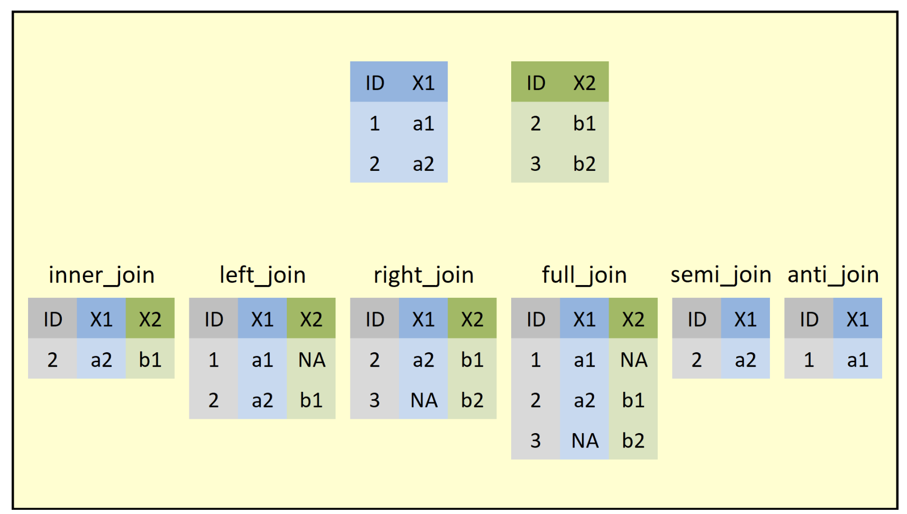

```{css, echo=FALSE}
/* custom.css */
.remark-slide-content {
font-size: 16px;
}
```


```{r include=FALSE}
library(tidyverse)
library(mosaic)
library(knitr)
library(ggthemes)
library(here)
library(flair)
library(nycflights13)
opts_chunk$set(
  message=FALSE,
  warning=FALSE,
  tidy=FALSE
  )
library(lubridate)
```

Much of this material can be found at:

http://cran.rstudio.com/web/packages/dplyr/vignettes/introduction.html

---

# Agenda  9/14/21

1. Tidy data
2. Data verbs

---

# The data


## What does a data set *look like*?

- **Observations** down the rows
- **Variables** across the columns
- Flat file versus relational database.

---

## Active Duty Military

The Active Duty data are not tidy!  What are the cases?  How are the data not tidy?  What might the data look like in tidy form?  Suppose that the case was "an individual in the armed forces."  What variables would you use to capture the information in the following table?

https://docs.google.com/spreadsheets/d/1Ow6Cm4z-Z1Yybk3i352msulYCEDOUaOghmo9ALajyHo/edit#gid=1811988794

```{r out.width = '100%', fig.align='center', echo=FALSE}
knitr::include_graphics("../images/activedutyTidy.png")
```

---

## Tidy packages: the tidyverse


```{r fig.cap = "image credit: https://www.tidyverse.org/.", fig.alt = "Image of hex stickers for the eight core tidyverse packages including ggplot2, dplyr, tidyr, readr, purrr, tibble, stringr, and forcats.", preview = TRUE, echo = FALSE}
knitr::include_graphics("../images/tidyverse.png")
```

---

## Reading in data from a file

Hosted online:

```{r load_from_file, eval = TRUE}
movies <- read_csv("http://pages.pomona.edu/~jsh04747/courses/math58/Math58Data/movies2.csv")
```

Hosted locally:
```{r load_local, eval = FALSE}
movies <- read_csv("movies2.csv")
```

Things to note:

- The assign arrow is used to create **objects** in R, which are stored in your
environment.
- Object names don't have to correspond to file names.
- Be sure R knows where to look for the file!

---

## Viewing data - the viewer / Environment

- `View()` can be used in RStudio to bring up an excel-style spreadsheet. Only
for viewing, not editing!
- The dimensions of the data can be found in the environment pane.
- The names of the variables can be seen at the top of the viewer.
- `View()` has a capital letter `V`
- `View()` should not be used in a Markdown or Sweave document

---
## Viewing data - inside .Rmd / the console

- `head()` can be used to print the first several lines of the dataset to the
console.
- `dim()` can be used to find the dimensions (rows then columns).
- `names()` can be used to find the names of the variables.


---

## Practice 

Running in to problems? Ask your neighbor or try google!

1. What are the dimensions of the data set?
2. What appears to be the unit of observation?
3. What are the variables?


```{r eval = TRUE}
dim(movies)
head(movies,3)
names(movies)
```

---
## Reading in data from a package

For now, we'll work with all flights out of the three NYC airports in 2013.

1. Download and install the package from CRAN (done in the Console, only once).
    ```{r, eval = FALSE}
    install.packages("nycflights13")
    ```
2. Load the package (in the .Rmd file, need it for the .Rmd file to compile appropriately).
    ```{r}
    library(nycflights13)
    ```
3. Make the data set visible.
    ```{r}
    data(flights)
    ```
4. Get help.
    ```{r eval = FALSE}
    ?flights
    ```

---

# Slice and dice with dplyr (a package within the tidyverse)

## **dplyr**

> Whenever you're learning a new tool, for a long time you're going to suck ...
> but the good news is that is typical, that's something that happens to everyone, 
> and it's only temporary.

-Hadley Wickham

---

## Why dplyr?

Data sets are often of high *volume* (lots of rows) and high *variety* (lots of columns). This is overwhelming to visualize and analyze, so we find ourselves chopping the data set up into more manageable and meaningful chunks. We also  often need to perform operations to organize and clean our data.

This is all possible in base R, but with `dplyr`, it is simple, readible, and fast.

---

## Some Basic Verbs

- `filter()`
- `arrange()`
- `select()`
- `distinct()`
- `mutate()`
- `summarize()`
- `sample_n()`

---

## `filter()`

Allows you to select a subset of the **rows** of a data frame. The first
argument is the name of the data frame, the following arguments are the
filters that you'd like to apply

For all flights on January 1st:

```{r message = FALSE, warning = FALSE}
filter(flights, month == 1, day == 1)
```

---

## Constructing filters

Filters are constructed of **logical operators**: `<`, `>`, `<=`, `>=`, `==`,
`!=` (and some others).

Adding them one by one to `filter()` is akin to saying "this AND that". To say
"this OR that OR both", use |.

```{r}
filter(flights, month == 1 | month == 2)
```

---
## Practice

Construct filters to isolate:

1. Flights that left on St. Patrick's Day.
2. Flights that were destined for Chicago's primary airport.
3. Flights that were destined for Chicago's primary airport and were operated by United Airlines.
4. Flights with flight times more than 2000 miles or that were in the air more than 5 hours.

---


1. Flights that left on St. Patrick's Day.
2. Flights that were destined for Chicago's primary airport.
3. Flights that were destined for Chicago's primary airport and were operated by
United Airlines.
4. Flights with flight times more than 2000 miles or that were in the air more
than 5 hours.

```{r eval = FALSE}
filter(flights, month == 3, day == 17)
filter(flights, dest == "ORD")
filter(flights, dest == "ORD", carrier == "UA")
filter(flights, distance > 2000 | air_time > 5*60)
```

---

## `arrange()`

`arrange()` reorders the rows: It takes a data frame, and a set of column 
names (or more complicated expressions) to order by. If you provide more than 
one column name, each additional column will be used to break ties in the values
of preceding columns:

```{r, eval = FALSE}
arrange(flights, year, month, day)
```

Use `desc()` to sort in descending order.

```{r, eval = FALSE}
arrange(flights, desc(arr_delay))
```

---

## `select()`

Often you work with large datasets with many columns where only a few are 
actually of interest to you. `select()` allows you to rapidly zoom in on a useful
subset using operations that usually only work on numeric variable positions:

```{r eval=FALSE}
select(flights, year, month, day)
```

You can exclude columns using `-` and specify a range using `:`.

```{r eval = FALSE}
select(flights, -(year:day))
```


---

## `distinct()`

A common use of `select()` is to find out which values a set of variables takes.  This is particularly useful in conjunction with the `distinct()` verb which only  returns the unique values in a table.

What do the following data correspond to?

```{r}
distinct(select(flights, origin, dest))
```

---

## `mutate()`

As well as selecting from the set of existing columns, it's often useful to add 
new columns that are functions of existing columns. This is the job of `mutate()`:

```{r}
select(mutate(flights, gain = dep_delay - arr_delay), 
       flight, dep_delay, arr_delay, gain)
```

---

## `summarize()` and `sample_n()`

`summarize()` collapses a data frame to a single row. It's not very useful yet. 
`sample_n()` provides you with a random sample of the rows.

```{r}
summarize(flights, delay = mean(dep_delay, na.rm = TRUE))
sample_n(flights, 10)
```

---
## Practice

**Mutate** the data to create a new column that contains the average speed traveled by the plane for each flight. 

**Select** the new variable and save it, along with tailnum, as a new data frame object.

---
## Practice

**Mutate** the data to create a new column that contains the average speed traveled by the plane for each flight. 

**Select** the new variable and save it, along with tailnum, as a new data frame object.

```{r}
flights2 <- mutate(flights, speed = distance/(air_time/60))
speed_data <- select(flights2, tailnum, speed)
```

---

## `group_by()`

`summarize()` and `sample_n()` are even more powerful when combined with the idea of  "group by", repeating the operation separately on groups of observations within the dataset. The `group_by()` function describes how to break a dataset down into groups of rows.

---

## `group_by()`

Find the fastest airplanes in the bunch, measured as the average speed per airplane.

```{r}
by_tailnum <- group_by(speed_data, tailnum)
avg_speed <- summarize(by_tailnum, 
                       count = n(), 
                       avg_speed = mean(speed, na.rm = TRUE))
arrange(avg_speed, desc(avg_speed))
```

---

## Chaining

Instead of applying each verb step-by-step, we can chain them into a single
data pipeline, connected with the `%>%` operator. You start the pipeline with
a data frame and then pass it to each function in turn.


The pipe syntax (`%>%`) takes a data frame and sends it to the argument of a function.  The mapping goes to the first available argument in the function.  For example:

`x %>% f(y)` is the same as `f(x, y)`

` y %>% f(x, ., z)` is the same as `f(x,y,z)`

---

## Mornings

```
step1 <- dress(me, what = sports)  
step2 <- exercise(step1, how = running)  
step3 <- eat(step2, choice = cereal)  
step4 <- dress(step3, what = school)  
step5 <- commute(step4, transportation = bike)  
```
---

## Mornings

```
commute(dress(eat(exercise(dress(me, what = sports), how = running), choice = cereal), what = school), transportation = bike)
```

---

## Morning

(better??)

```
commute(
  dress(
    eat(
      exercise(
        dress(me, 
              what = sports), 
        how = running), 
      choice = cereal), 
    what = school), 
  transportation = bike)
```

---

## Mornings

```
me %>%
  dress(what = sports) %>%
  exercise(how = running) %>%
  eat(choice = cereal) %>%
  dress(what = school) %>%
  commute(transportation = bike)
```

---

## Mornings

```
me %>%
  dress(what = sports) %>%
  exercise(how = running) %>%
  eat(choice = cereal) %>%
  dress(what = school) %>%
  commute(transportation = bike)
```

The pipe syntax (`%>%`) takes a data frame and sends it to the argument of a function.  The mapping goes to the first available argument in the function.  For example:

`x %>% f(y)` is the same as `f(x, y)`

` y %>% f(x, ., z)` is the same as `f(x,y,z)`

---

#### Little Bunny Foo Foo

From Hadley Wickham, how to think about tidy data.

> Little bunny Foo Foo

> Went hopping through the forest

> Scooping up the field mice

> And bopping them on the head

---

#### Little Bunny Foo Foo

The nursery rhyme could be created by a series of steps where the output from each step is saved as an object along the way.

```
foo_foo <- little_bunny()
foo_foo_1 <- hop(foo_foo, through = forest)
foo_foo_2 <- scoop(foo_foo_2, up = field_mice)
foo_foo_3 <- bop(foo_foo_2, on = head)
```
---

#### Little Bunny Foo Foo

Another approach is to concatenate the functions so that there is only one output.  

```
bop(
   scoop(
      hop(foo_foo, through = forest),
      up = field_mice),
   on = head)
```
---

#### Little Bunny Foo Foo

Or even worse, as one line:

```
bop(scoop(hop(foo_foo, through = forest), up = field_mice), on = head)))
```
---
#### Little Bunny Foo Foo

Instead, the code can be written using the pipe in the **order** in which the function is evaluated:

```
foo_foo %>%
   hop(through = forest) %>%
       scoop(up = field_mice) %>%
           bop(on = head)
```

---

#### Little Bunny Foo Foo

Instead, the code can be written using the pipe in the **order** in which the function is evaluated:

```
foo_foo %>%
   hop(through = forest) %>%
       scoop(up = field_mice) %>%
           bop(on = head)
```

The pipe syntax (`%>%`) takes a data frame and sends it to the argument of a function.  The mapping goes to the first available argument in the function.  For example:

`x %>% f(y)` is the same as `f(x, y)`

` y %>% f(x, ., z)` is the same as `f(x,y,z)`
---

```{r}
flights2 %>%
  select(tailnum, speed) %>%
  group_by(tailnum) %>% 
  summarize(number = n(), avg_speed = mean(speed, na.rm = TRUE)) %>%
  arrange(desc(avg_speed))
```

---

## Practice

Form a chain that creates a data frame containing only carrier and the mean departure delay time. Which carriers have the highest and lowest mean delays?

---

## Practice

Form a chain that creates a data frame containing only carrier and the mean departure delay time. Which carriers have the highest and lowest mean delays?

```{r}
flights %>%
  group_by(carrier) %>%
  summarize(avg_delay = mean(dep_delay, na.rm = TRUE)) %>%
  arrange(desc(avg_delay))
```

---

## Practice again

Say you're curious about the relationship between the number of flights each plane made in 2013, the mean distance that each of those planes flew, and the mean arrival delay. You also want to exclude the edge cases from your analysis, so focus on the planes that have logged more than 20 flights and flown an average distance of less than 2000 miles. Please form the chain that creates this dataset.

---

## Practice again

```{r}
delay_data <- flights %>%
  group_by(tailnum) %>%
  summarize(number = n(),
            dist = mean(distance, na.rm = TRUE), 
            delay = mean(arr_delay, na.rm = TRUE)) %>%
  filter(number > 20, dist < 2000)
```


Say you're curious about the relationship between the number of flights each plane made in 2013, the mean distance that each of those planes flew, and the mean arrival delay. You also want to exclude the edge cases from your analysis, so focus on the planes that have logged more than 20 flights and flown an average distance of less than 2000 miles. Please form the chain that creates this dataset. 
 
---

## Visualizing the data

.pull-left[ 
```{r eval = TRUE, message = FALSE, warning = FALSE, echo = FALSE}
library(ggplot2)
ggplot(delay_data, aes(dist, delay)) +
 geom_point(aes(size = number), alpha = 1/2) +
 geom_smooth() +
 scale_size_area()
```
]

.pull-right[
```{r eval = FALSE, message = FALSE, warning = FALSE, echo = TRUE}
delay_data %>%
 ggplot(aes(dist, delay)) +
 geom_point(aes(size = number), 
            alpha = 1/2) +
 geom_smooth() +
 scale_size_area()
```
When `scale_size_area` is used, the default behavior is to scale the area of points to be proportional to the value.
]

---

# Agenda  9/16/21


1. Relational data (`_join`)
2. `pivot`ing
3. `map`ping
4. **lubridate**

---

## Relational data (multiple data frames)


```{r out.width = '70%', fig.align='center', echo=FALSE}
knitr::include_graphics("../images/dplyr-joins.png")
```

See the [RStudio cheatsheets](https://www.rstudio.com/resources/cheatsheets/)

---
  
  
## Joining two (or more) dataframes:
  
* <mark>`left_join`</mark> returns all rows from the left table, and any rows with matching keys from the right table.
* <mark>`inner_join`</mark> returns only the rows in which the left table have matching keys in the right table (i.e., matching rows in both sets).
* <mark>`full_join`</mark> returns all rows from both tables, join records from the left which have matching keys in the right table.


Good practice:  always specify the `by` argument when joining data frames.


---

## Women in Science

10 women in science who changed the world (source: Discover Magazine)

```{r echo = FALSE}
library(kableExtra)
dates <- read_csv("../data/dates.csv")
professions <- read_csv("../data/professions.csv")
works <- read_csv("../data/works.csv")
```

```{r eval = FALSE, include = FALSE}
source: https://www.discovermagazine.com/the-sciences/meet-10-women-in-science-who-changed-the-world

From Mine: https://github.com/rstudio-education/datascience-box/tree/master/course-materials/slides/u2-d08-multi-df/data/scientists
```


```{r echo = FALSE}
professions %>%
  kable()
```

.footnote[Example and gifs from [DataScience in a Box](https://datasciencebox.org/)]
---

## Inputs

```{r echo = FALSE}
#devtools::install_github("gadenbuie/xaringanExtra")
library(xaringanExtra)
xaringanExtra::use_panelset()
```


Information on women scientists

.panelset[

.panel[.panel-name[professions]
```{r}
professions
```
]

.panel[.panel-name[dates]
```{r}
dates
```
]

.panel[.panel-name[works]
```{r}
works
```
]

]

---

## Desired output

We'd like to put together the data to look like:

```{r echo=FALSE}
professions %>%
  left_join(dates, by = "name") %>%
  left_join(works, by = "name")
```


---

## Inputs, reminder

.pull-left[
```{r}
nrow(professions)
nrow(dates)
nrow(works)
```
]
.pull-right[
```{r}
names(professions)
names(dates)
names(works)

```
]

---

## Setup

For the next few slides...

.pull-left[
```{r echo=FALSE}
x <- tibble(
  id = c(1, 2, 3),
  value_x = c("x1", "x2", "x3")
  )
```
```{r}
x
```
]
.pull-right[
```{r echo=FALSE}
y <- tibble(
  id = c(1, 2, 4),
  value_y = c("y1", "y2", "y4")
  )
```
```{r}
y
```
]

---

## `left_join()`

.pull-left[
```{r echo=FALSE, out.width="80%", out.extra ='style="background-color: #FDF6E3"'}
include_graphics("../images/left-join.gif")
```
]
.pull-right[
```{r}
left_join(x, y, by = "id")
```
]

---

## `left_join()`

```{r}
professions %>%
  left_join(dates, by = "name") 
```

---

## `right_join()`

.pull-left[
```{r echo=FALSE, out.width="80%", out.extra ='style="background-color: #FDF6E3"'}
include_graphics("../images/right-join.gif")
```
]
.pull-right[
```{r}
right_join(x, y, by = "id")
```
]

---

## `right_join()`


```{r}
professions %>%
  right_join(dates, by = "name") 
```

---

## `full_join()`

.pull-left[
```{r echo=FALSE, out.width="80%", out.extra ='style="background-color: #FDF6E3"'}
include_graphics("../images/full-join.gif")
```
]
.pull-right[
```{r}
full_join(x, y, by = "id")
```
]

---

## `full_join()`

```{r}
dates %>%
  full_join(works, by = "name") 
```

---

## `inner_join()`

.pull-left[
```{r echo=FALSE, out.width="80%", out.extra ='style="background-color: #FDF6E3"'}
include_graphics("../images/inner-join.gif")
```
]
.pull-right[
```{r}
inner_join(x, y, by = "id")
```
]

---

## `inner_join()`

```{r}
dates %>%
  inner_join(works, by = "name") 
```

---

## `semi_join()`

.pull-left[
```{r echo=FALSE, out.width="80%", out.extra ='style="background-color: #FDF6E3"'}
include_graphics("../images/semi-join.gif")
```
]
.pull-right[
```{r}
semi_join(x, y, by = "id")
```
]

---

## `semi_join()`

```{r}
dates %>%
  semi_join(works, by = "name") 
```

---

## `anti_join()`

.pull-left[
```{r echo=FALSE, out.width="80%", out.extra ='style="background-color: #FDF6E3"'}
include_graphics("../images/anti-join.gif")
```
]
.pull-right[
```{r}
anti_join(x, y, by = "id")
```
]

---

## `anti_join()`

```{r}
dates %>%
  anti_join(works, by = "name") 
```

---

## Putting it altogether

```{r}
professions %>%
  left_join(dates, by = "name") %>%
  left_join(works, by = "name")
```


---

### From wide to long and long to wide

* <mark>`pivot_longer()`</mark> makes the dataframe "longer" -- many columns into a few columns (more rows): `pivot_longer(data, cols,  names_to = , value_to = )`
* <mark>`pivot_wider()`</mark> makes the dataframe "wider" -- a few columns into many columns (fewer rows): `pivot_wider(data, names_from = , values_from = )`

```{r out.width = '47%', fig.align='center', echo=FALSE, fig.show='hold'}
knitr::include_graphics(c("../images/pivotlonger.png", "../images/pivotwider.png"))
```

---
  
### `pivot_longer`
  
`pivot_longer` will be demonstrated using datasets come from GapMinder.  The first represents country, year, and <mark>female literacy rate</mark>. 

```{r message=FALSE}
library(googlesheets4)
gs4_deauth()
litF <- read_sheet("https://docs.google.com/spreadsheets/d/1hDinTIRHQIaZg1RUn6Z_6mo12PtKwEPFIz_mJVF6P5I/pub?gid=0")

head(litF)
```

---
### `pivot_longer`
  
```{r}
litF <- litF %>% select(country=starts_with("Adult"), 
                              starts_with("1"), starts_with("2")) %>%
  pivot_longer(cols = -country, 
                      names_to = "year", values_to = "litRateF") %>%
  filter(!is.na(litRateF))

litF
```


---
  
### `pivot_longer`
  
The second dataset (GDP) represents country, year, and <mark>gdp</mark> (in fixed 2000 US$).

```{r message=FALSE}
GDP <- read_sheet("https://docs.google.com/spreadsheets/d/1RctTQmKB0hzbm1E8rGcufYdMshRdhmYdeL29nXqmvsc/pub?gid=0")

GDP <- GDP %>% select(country = starts_with("Income"), 
                            starts_with("1"), starts_with("2")) %>%
  pivot_longer(cols = -country, names_to = "year", 
                      values_to = "gdp") %>%
  filter(!is.na(gdp))

GDP
```


---
  
### `pivot_wider`

`pivot_wider`  will be demonstrated using the babynames dataset.

```{r}
library(babynames)

babynames
```

---

```{r}
babynames %>% select(-prop) %>%
  pivot_wider(names_from = sex, values_from = n) 
```

---
  
```{r}
babynames %>% 
  select(-prop) %>% 
  pivot_wider(names_from = sex, values_from = n) %>%
  filter(!is.na(F), !is.na(M)) %>%
  arrange(desc(year), desc(M))
```

---
  
```{r}
babynames %>% 
  pivot_wider(names_from = sex, values_from = n) %>%
  mutate(maxcount = pmax(F,M, na.rm = TRUE)) %>%
  arrange(desc(maxcount))
```

---


## Practice `litF` and `GDP` from Gapminder.

### left
```{r}
litGDPleft <- left_join(litF, GDP, by=c("country", "year"))
dim(litGDPleft)
litGDPleft
```


---

### right
```{r}
litGDPright <- right_join(litF, GDP, by=c("country", "year"))
dim(litGDPright)
litGDPright
```


---

### inner
```{r}
litGDPinner <- inner_join(litF, GDP, by=c("country", "year"))
dim(litGDPinner)
litGDPinner
```

---

### full
```{r}
litGDPfull <- full_join(litF, GDP, by=c("country", "year"))
dim(litGDPfull)
litGDPfull
```
---
 

## `join` to **merge** two datasets

```{r out.width = '90%', fig.align='center', echo=FALSE}

```


If you ever need to understand which join is the right join for you, try to find an image that will lay out what the function is doing.  I found this one that is quite good and is taken from Statistics Globe blog: https://statisticsglobe.com/r-dplyr-join-inner-left-right-full-semi-anti

---

## **purrr** for functional programming

.pull-left[
The `map` functions are *named* by the **output** the produce.  For example: 

* `map(.x, .f)` is the main mapping function and returns a list

* `map_df(.x, .f)` returns a data frame

* `map_dbl(.x, .f)` returns a numeric (double) vector

* `map_chr(.x, .f)` returns a character vector

* `map_lgl(.x, .f)` returns a logical vector
]

.pull-right[
```{r out.width = '90%', fig.align='center', echo=FALSE}
knitr::include_graphics("../images/purrr_map.png")
```
]


Note that the first argument is always the data object and the second object is always the function you want to iteratively apply to each element in the input object.

---

### Input

The **input** to a `map` function is always either a *vector* (like a column), a *list* (which can be non-rectangular), or a *dataframe* (like a rectangle).

A list is a way to hold things which might be very different in shape:

```{r}
a_list <- list(a_number = 5,
                      a_vector = c("a", "b", "c"),
                      a_dataframe = data.frame(a = 1:3, 
                                               b = c("q", "b", "z"), 
                                               c = c("bananas", "are", "so very great")))

a_list
```

---

###  Output


```{r}
add_ten <- function(x) {
  return(x + 10)
  }
```

We can `map()` the `add_ten()` function across a vector.  Note that the output is a list (the default).

```{r}
library(tidyverse)
map(.x = c(2, 5, 10),
    .f = add_ten)
```

---

###  Output & Input

What if we use a different type of input?  The default behavior is to still return a list!

```{r}
data.frame(a = 2, b = 5, c = 10) %>%
  map(add_ten)
```

What if we want a different type of output?  We use a different `map()` function, `map_df()`, for example.

```{r}
data.frame(a = 2, b = 5, c = 10) %>%
  map_df(add_ten)
```

---

### Shorthand

Shorthand lets us get away from pre-defining the function (which will be useful).  Use the tilde `~` to indicate that you have a function: 

```{r}
data.frame(a = 2, b = 5, c = 10) %>%
  map_df(~{.x + 10})
```

---
### Shorthand in more complex settings

```{r}
library(palmerpenguins)
library(broom)

penguins %>%
  split(.$species) %>%
  map(~ lm(body_mass_g ~ flipper_length_mm, data = .x)) %>%
  map_df(tidy)  # map(tidy)

penguins %>%
  group_by(species) %>%
  group_map(~lm(body_mass_g ~ flipper_length_mm, data = .x)) %>%
  map(tidy)  # map_df(tidy)
```


---


## `lubridate`
  
`lubridate` is a another R package meant for data wrangling!  

In particular, `lubridate` makes it very easy to work with days, times, and dates.  The base idea is to start with dates in a `ymd` (year month day) format and transform the information into whatever you want.  

Example from  https://cran.r-project.org/web/packages/lubridate/vignettes/lubridate.html

---

### If anyone drove a time machine, they would crash

The length of months and years change so often that doing arithmetic with them can be unintuitive. <mark>Consider a simple operation, January 31st + one month.</mark>


---

### If anyone drove a time machine, they would crash

The length of months and years change so often that doing arithmetic with them can be unintuitive. <mark>Consider a simple operation, January 31st + one month.</mark>

Should the answer be:
  
1. February 31st (which doesn't exist)
2. March 4th (31 days after January 31), or
3. February 28th (assuming its not a leap year)

A basic property of arithmetic is that a + b - b = a. Only solution 1 obeys the mathematical property, but it is an invalid date. Wickham wants to  make lubridate as consistent as possible by invoking the following rule: <mark>if adding or subtracting a month or a year creates an invalid date, lubridate will return an NA. </mark>

If you thought solution 2 or 3 was more useful, no problem. You can still get those results with clever arithmetic, or by using the special `%m+%` and `%m-%` operators. `%m+%` and `%m-%` automatically roll dates back to the last day of the month, should that be necessary.
---

## basics in `lubridate` 

```{r message=FALSE}
library(lubridate); rightnow <- now()

day(rightnow)
week(rightnow)
month(rightnow, label=FALSE)
month(rightnow, label=TRUE)
year(rightnow)
```

---
## basics in `lubridate` 

```{r}
minute(rightnow)
hour(rightnow)

yday(rightnow)
mday(rightnow)
wday(rightnow, label=FALSE)
wday(rightnow, label=TRUE)
```

---

## But how do I create a date object?

```{r}
jan31 <- ymd("2021-01-31")
jan31 + months(0:11)

floor_date(jan31, "month") + months(0:11) + days(31)
jan31 + months(0:11) + days(31)

jan31 %m+% months(0:11)
```

---

## NYC flights 
```{r message=FALSE}
library(nycflights13)
names(flights)
```

---

## NYC flights 
```{r message=FALSE}
flightsWK <- flights %>% 
   mutate(ymdday = ymd(paste(year, month,day, sep="-"))) %>%
   mutate(weekdy = wday(ymdday, label=TRUE), 
          whichweek = week(ymdday)) 

flightsWK %>% select(year, month, day, ymdday, weekdy, whichweek, 
                     dep_time, arr_time, air_time) 
```

---

## `reprex`

> Help me help you

`repr`oducible `ex`ample ...

Step 1.  Copy code onto the clipboard

Step 2.  Type `reprex()` into the Console

Step 3.  Look at the Viewer to the right.  Copy the Viewer output into GitHub, Piazza, Discord, an email, stackexchange, etc.

---

##  `reprex` demo

```
reprex(
  jan31 + months(0:11) + days(31)
)
```
multiple lines of code:

```
reprex({
  jan31 <- ymd("2021-01-31")
  jan31 + months(0:11) + days(31)
})
```

```
reprex({
  library(lubridate)
  jan31 <- ymd("2021-01-31")
  jan31 + months(0:11) + days(31)
})
```