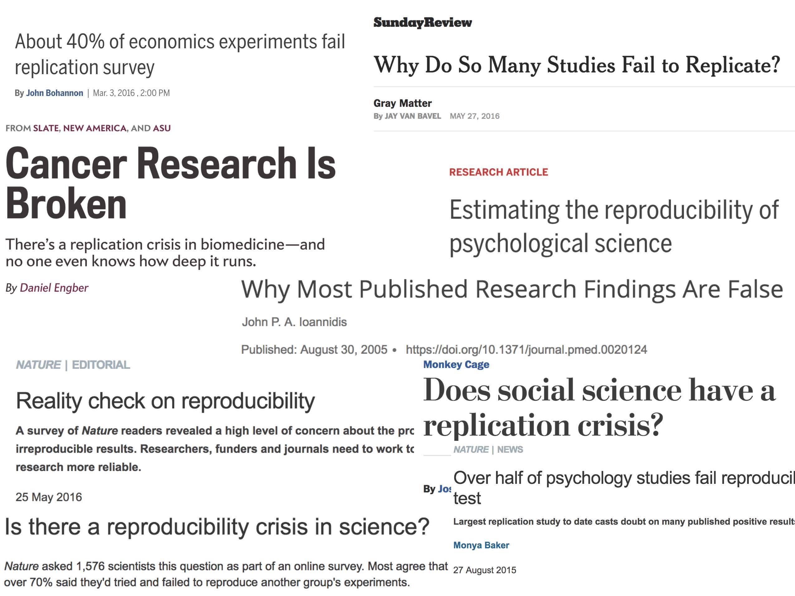
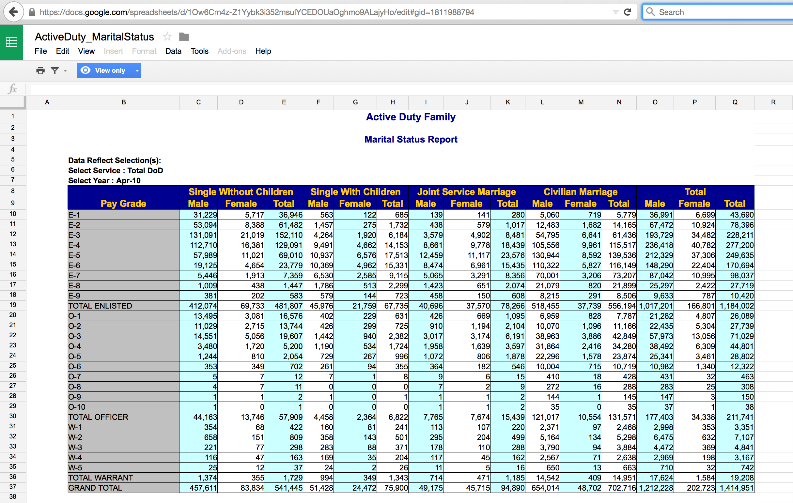
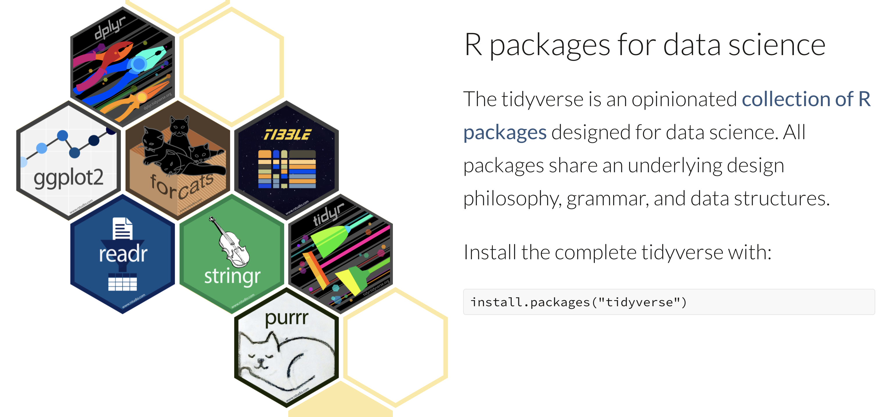

```{r xaringan-themer, include=FALSE, warning=FALSE}
library(xaringanthemer)
style_mono_accent(
  base_color = "#877e2c",
  header_font_google = google_font("Metropolis"),
  text_font_google   = google_font("Metropolis", "300", "300i"),
  code_font_google   = google_font("Metropolis"),
  title_slide_background_color = "#FFFFFF",
  title_slide_text_color = "#877e2c"
)
```

```{r include=FALSE}
library(mosaic)
library(knitr)
library(tidyverse)
library(nycflights13)
opts_chunk$set(
  message=FALSE,
  warning=FALSE,
  size='small',
  tidy=FALSE
  )
library(lubridate)
library(sysfonts)
options(width=65)
```


## Agenda 1/18/22

1. [Syllabus](../syllabus/)
2. Workflow
3. Wrangling
4. Statistics

---

## Course structure

* weekly HW (to GitHub)
* daily WU (to Gradescope while virtual)
* three exams + data project
* in-class activities / clickers

---

## Learning Communities

* mentorless pods (fill out Google form after class)
* meet with group periodically
* work party on Slack or Zoom
* regular mentor session: Mon & Thurs 8-10pm

---

## Additional details

* Sakai has all the links
* course website has all the information
* semester flexibility -- good communication
* must be on Slack (the HW link will be posted to Slack)

---

Reproducibility


```{r, out.width = "800px", echo=FALSE}

```

---

## Example #1

### Science retracts gay marriage paper without agreement of lead author LaCour

* In May 2015 Science retracted a study of how canvassers can sway people’s opinions about gay marriage published just 5 months prior.

* Science Editor-in-Chief Marcia McNutt: 
    + Original survey data not made available for independent reproduction of results. 
    + Survey incentives misrepresented. 
    + Sponsorship statement false.

* Two Berkeley grad students who attempted to replicate the study quickly discovered that the data must have been faked.

* Methods we’ll discuss can’t prevent this, but they can make it easier to discover issues.

Source: http://news.sciencemag.org/policy/2015/05/science-retracts-gay-marriage-paper-without-lead-author-s-consent

---

## Example #2

### Seizure study retracted after authors realize data got "terribly mixed"

* From the authors of Low Dose Lidocaine for Refractory Seizures in Preterm Neonates:

>The article has been retracted at the request of the authors. After carefully re-examining the data presented in the article, they identified that data of two different hospitals got terribly mixed. The published results cannot be reproduced in accordance with scientific and clinical correctness.

Source: http://retractionwatch.com/2013/02/01/seizure-study-retracted-after-authors-realize-data-got-terribly-mixed/

---

## Example #3


### Bad spreadsheet merge kills depression paper, quick fix resurrects it

* The authors informed the journal that the merge of lab results and other survey data used in the paper resulted in an error regarding the identification codes. Results of the analyses were based on the data set in which this error occurred. Further analyses established the results reported in this manuscript and interpretation of the data are not correct.

* Original conclusion: Lower levels of CSF IL-6 were associated with current depression and with future depression […].

* Revised conclusion: Higher levels of CSF IL-6 and IL-8 were associated with current depression […].

Source: http://retractionwatch.com/2014/07/01/bad-spreadsheet-merge-kills-depression-paper-quick-fix-resurrects-it/

---

## Example #4


### Boys will be boys: Data error prompts U-turn on study of sex differences in school

* In a follow-up project, the authors realized their results were opposite of the literature.

* The first author, Gunzenhauser, told Retraction Watch:

> After some research I found there had been a systematic coding error during data entry (the 0/1 coding for “boy” and “girl” that we had on the paper questionnaires was opposite to the one in the SPSS labels).


Source: https://retractionwatch.com/2017/10/17/boys-will-boys-data-error-prompts-u-turn-study-sex-differences-school/


---

## Reproducible data analysis


* Scriptability → R [in contrast to pull down menus]

* Literate programming → R Markdown [in contrast to multiple files]

* Version control → Git / GitHub [in contrast to multiple versions]


---

## Scripting and literate programming

### Donald Knuth "Literate Programming" (1983)

>Let us change our traditional attitude to the construction of programs: Instead of imagining that our main task is to instruct a computer- what to do, let us concentrate rather on explaining to human beings- what we want a computer to do.

* These ideas have been around for years!
* and tools for putting them to practice have also been around
* but they have never been as accessible as the current tools


---

## Reproducibility checklist


* Are the tables and figures reproducible from the code and data?
* Does the code actually do what you think it does?
* In addition to what was done, is it clear why it was done? (e.g., how were parameter settings chosen?)
* Can the code be used for other data?
* Can you extend the code to do other things?

---

## Tools: R & R Studio


* You must use both software programs
* R does the programming
* R Studio brings everything together
* You may use Pomona's server: https://rstudio.campus.pomona.edu/ (or https://rstudio.cloud)
* See course website for getting started: https://m158-lin-mod.netlify.app/github.html

---

## R vs R Studio


```{r fig.cap = "Taken from [Modern Drive: An introduction to statistical and data sciences via R](https://ismayc.github.io/moderndiver-book/), by Ismay and Kim", out.width = "800px", fig.align='center', echo=FALSE}
knitr::include_graphics("../images/RRstudio.jpg")
```

---

## R Studio


```{r fig.cap = "[Jessica Ward](https://jkrward.github.io/), PhD student at Newcastle University",out.width = "1000px", fig.align='center', echo=FALSE}
knitr::include_graphics("../images/cookingRstudio.jpg")
```

---

## Tools: GitHub


* You must submit your assignments via GitHub
* Follow Jenny Bryan's advice on how to get set-up: http://happygitwithr.com/
* Follow course specific advice: https://m158-lin-mod.netlify.app/github.html

---

## Steps for weekly homework


1. You will get a link to the new assignment (clicking on the link will create a new private repo)  
2. Use R Studio  
     + New Project, version control, Git  
     + Clone the repo using SSH  
3. If it exists, rename the Rmd file to ma158-hw#-lname-fname.Rmd  
4. Do the assignment  
     + **commit** and **push** after every problem  
5. All necessary files *must* be in the same folder (e.g., data)  

---

## Tools: a GitHub merge conflict (demo)


- On GitHub (on the web) edit the README document and Commit it with a message describing what you did.

- Then, in RStudio also edit the README document with a different change.
     + Commit your changes
     + Try to push – you’ll get an error!
     + Try pulling
     + Resolve the merge conflict and then commit and push
 
- As you work in teams you will run into merge conflicts, learning how to resolve them properly will be very important.

---

## Tools: a GitHub merge conflict


```{r, out.width = "300px", echo=FALSE}
knitr::include_graphics("../images/git_xkcd.png")
```


---

# The data


## What does a tidy data set *look like*?

- **Observations** down the rows
- **Variables** across the columns
- Flat file versus relational database.

---

## Active Duty Military

The Active Duty data are not tidy!  What are the cases?  How are the data not tidy?  What might the data look like in tidy form?  Suppose that the case was "an individual in the armed forces."  What variables would you use to capture the information in the following table?

https://docs.google.com/spreadsheets/d/1Ow6Cm4z-Z1Yybk3i352msulYCEDOUaOghmo9ALajyHo/edit#gid=1811988794

```{r out.width = '100%', fig.align='center', echo=FALSE}

```

---

## Tidy packages: the tidyverse


```{r fig.cap = "image credit: https://www.tidyverse.org/.", fig.alt = "Image of hex stickers for the eight core tidyverse packages including ggplot2, dplyr, tidyr, readr, purrr, tibble, stringr, and forcats.", preview = TRUE, echo = FALSE}

```

---

## Reading in data from a file

Hosted online:

```{r load_from_file, eval = TRUE}
movies <- read_csv("http://pages.pomona.edu/~jsh04747/courses/math58/Math58Data/movies2.csv")
```

Hosted locally:
```{r load_local, eval = FALSE}
movies <- read_csv("movies2.csv")
```

Things to note:

- The assign arrow is used to create **objects** in R, which are stored in your
environment.
- Object names don't have to correspond to file names.
- Be sure R knows where to look for the file!

---

## Viewing data - the viewer / Environment

- `View()` can be used in RStudio to bring up an excel-style spreadsheet. Only
for viewing, not editing!
- The dimensions of the data can be found in the environment pane.
- The names of the variables can be seen at the top of the viewer.
- `View()` has a capital letter `V`
- `View()` should not be used in an Rmd document

---
## Viewing data - inside .Rmd / the console

- `head()` can be used to print the first several lines of the dataset to the
console.
- `dim()` can be used to find the dimensions (rows then columns).
- `names()` can be used to find the names of the variables.


---

## Practice 

Running in to problems? Ask your neighbor or try google!

1. What are the dimensions of the data set?
2. What appears to be the unit of observation?
3. What are the variables?


```{r eval = TRUE}
dim(movies)
head(movies,3)
names(movies)
```

---
## Reading in data from a package

For now, we'll work with all flights out of the three NYC airports in 2013.

1. Download and install the package from CRAN (done in the Console, only once).
    ```{r, eval = FALSE}
    install.packages("nycflights13")
    ```
2. Load the package (in the .Rmd file, need it for the .Rmd file to compile appropriately).
    ```{r}
    library(nycflights13)
    ```
3. Make the data set visible.
    ```{r}
    data(flights)
    ```
4. Get help.
    ```{r eval = FALSE}
    ?flights
    ```

---

## wrangling with tidy verbs

> Whenever you're learning a new tool, for a long time you're going to suck ...
> but the good news is that is typical, that's something that happens to everyone, 
> and it's only temporary.

-Hadley Wickham

---

## Why tidyverse verbs?

Data sets are often of high *volume* (lots of rows) and high *variety* (lots of columns). This is overwhelming to visualize and analyze, so we find ourselves chopping the data set up into more manageable and meaningful chunks. We also  often need to perform operations to organize and clean our data.

This is all possible in base R, but with the **tidyverse**, it is simple, readable, and fast.

---

## Some Basic Verbs

- `filter()`
- `arrange()`
- `select()`
- `distinct()`
- `mutate()`
- `summarize()`
- `sample_n()`

---

## `filter()`

Allows you to select a subset of the **rows** of a data frame. The first
argument is the name of the data frame, the following arguments are the
filters that you'd like to apply

For all flights on January 1st:

```{r message = FALSE, warning = FALSE}
filter(flights, month == 1, day == 1)
```

---

## Constructing filters

Filters are constructed of **logical operators**: `<`, `>`, `<=`, `>=`, `==`,
`!=` (and some others).

Adding them one by one to `filter()` is akin to saying "this AND that". To say
"this OR that OR both", use |.

```{r}
filter(flights, month == 1 | month == 2)
```

---
## Practice

Construct filters to isolate:

1. Flights that left on St. Patrick's Day.
2. Flights that were destined for Chicago's primary airport.
3. Flights that were destined for Chicago's primary airport and were operated by United Airlines.
4. Flights with flight times more than 2000 miles or that were in the air more than 5 hours.

---


1. Flights that left on St. Patrick's Day.
2. Flights that were destined for Chicago's primary airport.
3. Flights that were destined for Chicago's primary airport and were operated by
United Airlines.
4. Flights with flight times more than 2000 miles or that were in the air more
than 5 hours.

```{r eval = FALSE}
filter(flights, month == 3, day == 17)
filter(flights, dest == "ORD")
filter(flights, dest == "ORD", carrier == "UA")
filter(flights, distance > 2000 | air_time > 5*60)
```

---

## `arrange()`

`arrange()` reorders the rows: It takes a data frame, and a set of column 
names (or more complicated expressions) to order by. If you provide more than 
one column name, each additional column will be used to break ties in the values
of preceding columns:

```{r, eval = FALSE}
arrange(flights, year, month, day)
```

Use `desc()` to sort in descending order.

```{r, eval = FALSE}
arrange(flights, desc(arr_delay))
```

---

## `select()`

Often you work with large datasets with many columns where only a few are 
actually of interest to you. `select()` allows you to rapidly zoom in on a useful
subset using operations that usually only work on numeric variable positions:

```{r eval=FALSE}
select(flights, year, month, day)
```

You can exclude columns using `-` and specify a range of variables using `:`.

```{r eval = FALSE}
select(flights, -(year:day))
```


---

## `distinct()`

A common use of `select()` is to find out which values a set of variables takes.  This is particularly useful in conjunction with the `distinct()` verb which only  returns the unique values in a table.

What do the following data correspond to?

```{r}
distinct(select(flights, origin, dest))
```

---

## `mutate()`

As well as selecting from the set of existing columns, it's often useful to add 
new columns that are functions of existing columns. This is the job of `mutate()`:

```{r}
select(mutate(flights, gain = dep_delay - arr_delay), 
       flight, dep_delay, arr_delay, gain)
```

---

## `summarize()` and `sample_n()`

`summarize()` collapses a data frame to a single row. It's not very useful yet. 
`sample_n()` provides you with a random sample of the rows.

```{r}
summarize(flights, delay = mean(dep_delay, na.rm = TRUE))
sample_n(flights, 10)
```

---
## Practice

**Mutate** the data to create a new column that contains the average speed traveled by the plane for each flight. 

**Select** the new variable and save it, along with tailnum, as a new data frame object.

---
## Practice

**Mutate** the data to create a new column that contains the average speed traveled by the plane for each flight. 

**Select** the new variable and save it, along with tailnum, as a new data frame object.

```{r}
flights2 <- mutate(flights, speed = distance/(air_time/60))
speed_data <- select(flights2, tailnum, speed)
```

---

## `group_by()`

`summarize()` and `sample_n()` are even more powerful when combined with the idea of  "group by", repeating the operation separately on groups of observations within the dataset. The `group_by()` function describes how to break a dataset down into groups of rows.

---

## `group_by()`

Find the fastest airplanes in the bunch, measured as the average speed per airplane.

```{r}
by_tailnum <- group_by(speed_data, tailnum)
avg_speed <- summarize(by_tailnum, 
                       count = n(), 
                       avg_speed = mean(speed, na.rm = TRUE))
arrange(avg_speed, desc(avg_speed))
```

---

## Chaining

Instead of applying each verb step-by-step, we can chain them into a single
data pipeline, connected with the `%>%` operator. You start the pipeline with
a data frame and then pass it to each function in turn.


The pipe syntax (`%>%`) takes a data frame and sends it to the argument of a function.  The mapping goes to the first available argument in the function.  For example:

`x %>% f(y)` is the same as `f(x, y)`

` y %>% f(x, ., z)` is the same as `f(x,y,z)`

---

## Mornings

```
step1 <- dress(me, what = sports)  
step2 <- exercise(step1, how = running)  
step3 <- eat(step2, choice = cereal)  
step4 <- dress(step3, what = school)  
step5 <- commute(step4, transportation = bike)  
```
---

## Mornings

```
commute(dress(eat(exercise(dress(me, what = sports), how = running), choice = cereal), what = school), transportation = bike)
```

---

## Mornings

(better??)

```
commute(
  dress(
    eat(
      exercise(
        dress(me, 
              what = sports), 
        how = running), 
      choice = cereal), 
    what = school), 
  transportation = bike)
```

---

## Mornings

```
me %>%
  dress(what = sports) %>%
  exercise(how = running) %>%
  eat(choice = cereal) %>%
  dress(what = school) %>%
  commute(transportation = bike)
```

---

## Mornings

```
me %>%
  dress(what = sports) %>%
  exercise(how = running) %>%
  eat(choice = cereal) %>%
  dress(what = school) %>%
  commute(transportation = bike)
```

The pipe syntax (`%>%`) takes a data frame and sends it to the argument of a function.  The mapping goes to the first available argument in the function.  For example:

`x %>% f(y)` is the same as `f(x, y)`

` y %>% f(x, ., z)` is the same as `f(x,y,z)`

---

#### Little Bunny Foo Foo

From Hadley Wickham, how to think about piping tidy verbs.

> Little bunny Foo Foo

> Went hopping through the forest

> Scooping up the field mice

> And bopping them on the head

---

#### Little Bunny Foo Foo

The nursery rhyme could be created by a series of steps where the output from each step is saved as an object along the way.

```
foo_foo <- little_bunny()
foo_foo_1 <- hop(foo_foo, through = forest)
foo_foo_2 <- scoop(foo_foo_2, up = field_mice)
foo_foo_3 <- bop(foo_foo_2, on = head)
```
---

#### Little Bunny Foo Foo

Another approach is to concatenate the functions so that there is only one output.  

```
bop(
   scoop(
      hop(foo_foo, through = forest),
      up = field_mice),
   on = head)
```
---

#### Little Bunny Foo Foo

Or even worse, as one line:

```
bop(scoop(hop(foo_foo, through = forest), up = field_mice), on = head)))
```
---
#### Little Bunny Foo Foo

Instead, the code can be written using the pipe in the **order** in which the function is evaluated:

```
foo_foo %>%
   hop(through = forest) %>%
       scoop(up = field_mice) %>%
           bop(on = head)
```

---

#### Little Bunny Foo Foo

Instead, the code can be written using the pipe in the **order** in which the function is evaluated:

```
foo_foo %>%
   hop(through = forest) %>%
       scoop(up = field_mice) %>%
           bop(on = head)
```

The pipe syntax (`%>%`) takes a data frame and sends it to the argument of a function.  The mapping goes to the first available argument in the function.  For example:

`x %>% f(y)` is the same as `f(x, y)`

` y %>% f(x, ., z)` is the same as `f(x,y,z)`
---

```{r}
flights2 %>%
  select(tailnum, speed) %>%
  group_by(tailnum) %>% 
  summarize(number = n(), avg_speed = mean(speed, na.rm = TRUE)) %>%
  arrange(desc(avg_speed))
```

---

## Practice

Form a chain that creates a data frame containing only carrier and the mean departure delay time. Which carriers have the highest and lowest mean delays?

---

## Practice

Form a chain that creates a data frame containing only carrier and the mean departure delay time. Which carriers have the highest and lowest mean delays?

```{r}
flights %>%
  group_by(carrier) %>%
  summarize(avg_delay = mean(dep_delay, na.rm = TRUE)) %>%
  arrange(desc(avg_delay))
```

---

## Practice again

Say you're curious about the relationship between the number of flights each plane made in 2013, the mean distance that each of those planes flew, and the mean arrival delay. You also want to exclude the edge cases from your analysis, so focus on the planes that have logged more than 20 flights and flown an average distance of less than 2000 miles. Please form the chain that creates this dataset.

---

## Practice again

```{r}
delay_data <- flights %>%
  group_by(tailnum) %>%
  summarize(number = n(),
            dist = mean(distance, na.rm = TRUE), 
            delay = mean(arr_delay, na.rm = TRUE)) %>%
  filter(number > 20, dist < 2000)
```


Say you're curious about the relationship between the number of flights each plane made in 2013, the mean distance that each of those planes flew, and the mean arrival delay. You also want to exclude the edge cases from your analysis, so focus on the planes that have logged more than 20 flights and flown an average distance of less than 2000 miles. Please form the chain that creates this dataset. 
 
