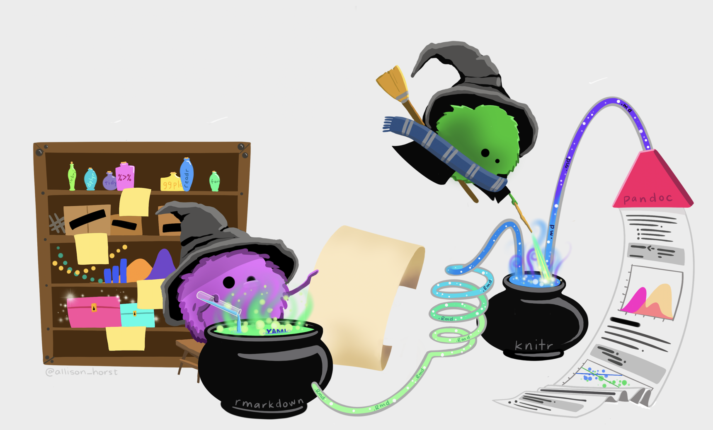

```{r setup, include=FALSE}
knitr::opts_chunk$set(echo = FALSE)
```

```{r fig.cap = "Artwork by @allison_horst.", fig.alt = "Two monsters working magic to come up with a complete data analysis and presentation.", preview = TRUE, echo = FALSE}

```

# Project Instructions


More soon


