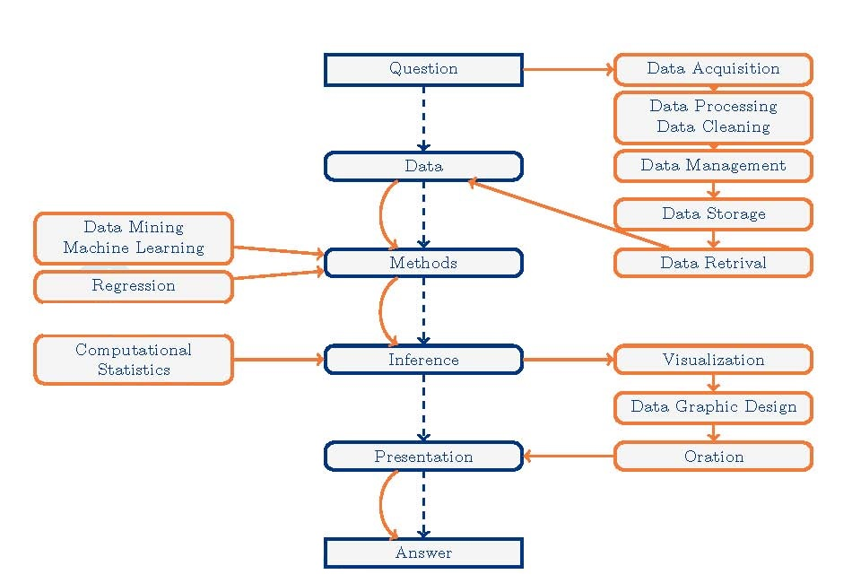
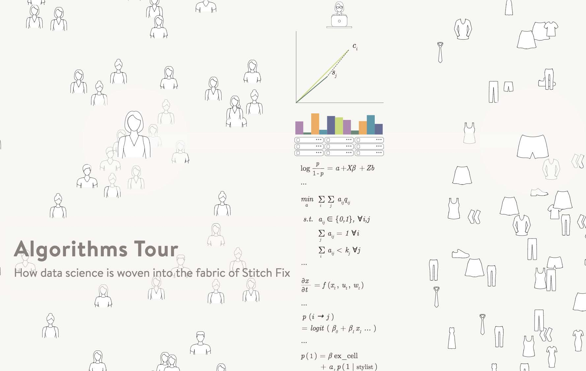
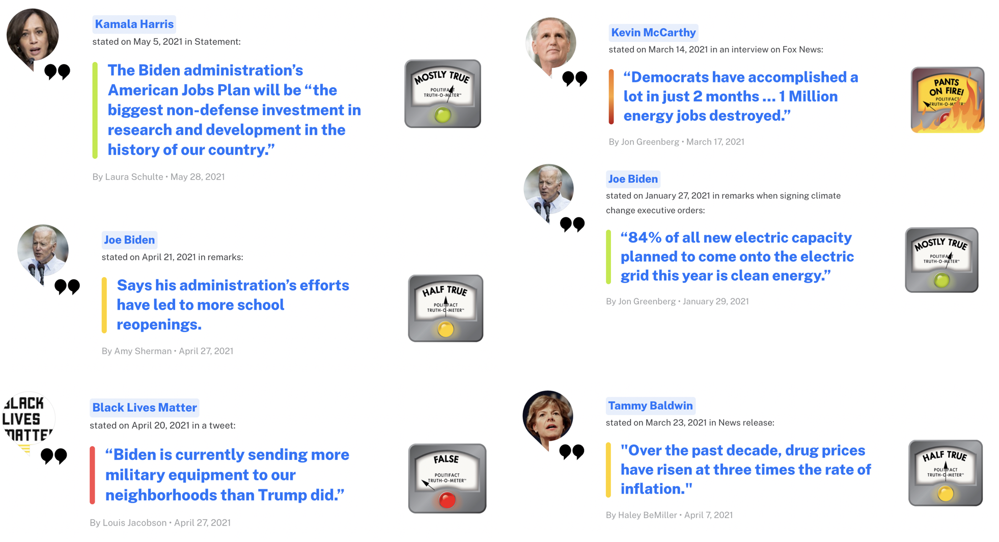
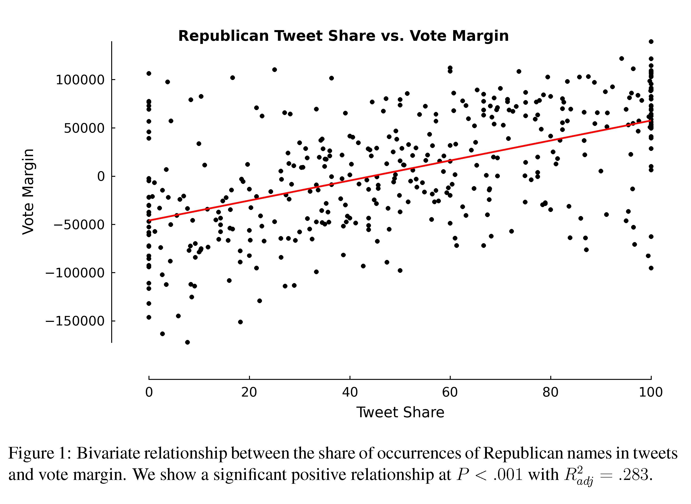
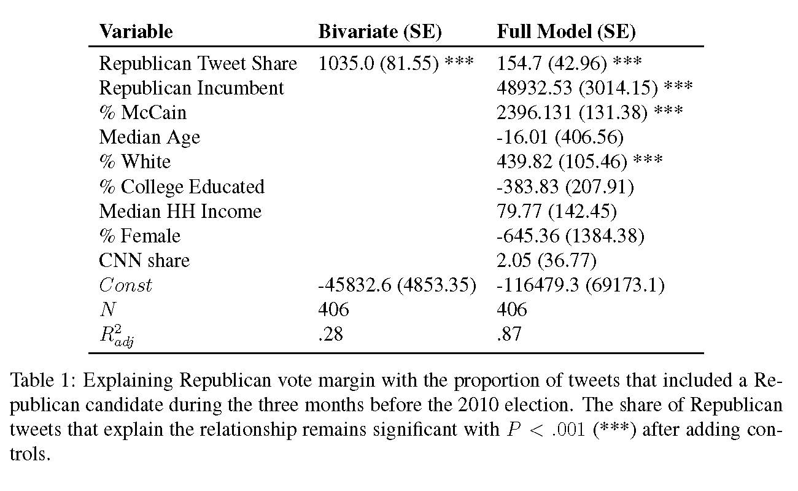
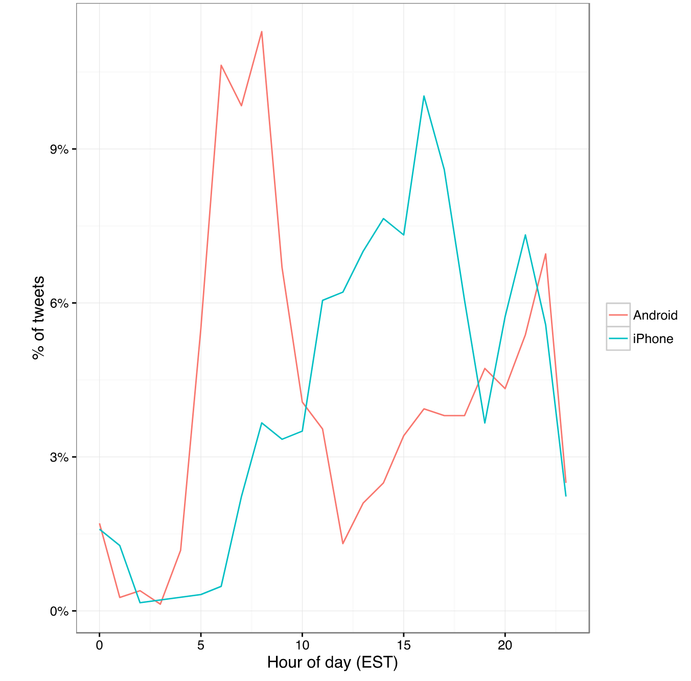
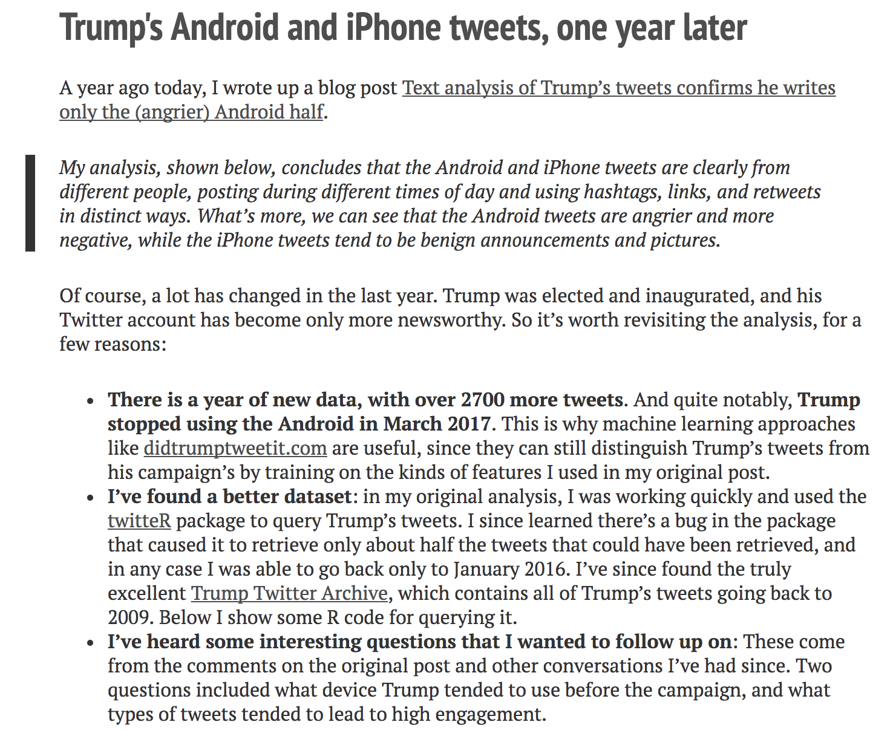

```{r include=FALSE}
library(ggplot2)
library(dplyr)
library(mosaic)
library(knitr)
library(ggthemes)
opts_chunk$set(
  message=FALSE,
  warning=FALSE,
  size='small',
  tidy=FALSE
  )
library(lubridate)
library(sysfonts)
options(width=65)
```


Agenda 8/31/21
=====

1. [Syllabus](../syllabus/)
3. Workflow
4. Stitch Fix
5. College Rankings
6. Twitter

Note: before Thursday, listen to the <a href = "https://nssdeviations.com/71-compromised-shoe-situation" target = "_blank">full conversation</a> of Not So Standard Deviations - Compromised Shoe Situation.


Course structure
=========================
* weekly HW (to GitHub + Gradescope)
* two exams + data project
* in-class activities / clickers
* ethical considerations


Additional details
=========================
* Sakai has all the links
* no computers (tablets fine)
* semester flexibility -- good communication
* Discord message board -- post to the entire class

Workflow
=========================
```{r, out.width = "800px", echo=FALSE}

```


Stitch Fix
=========================

```{r, out.width = "800px", echo=FALSE}

```


http://algorithms-tour.stitchfix.com/


What can/can't statistics & data science do?
=========================

* Can model the data at hand!
* Can find patterns & visualizations in large datasets.
* Can't establish causation (mostly).
* Can't represent data if it isn't there.


Stats / Data Science / Math are not apolitical/agnostic
=========================

Source: https://www.politifact.com/truth-o-meter/

```{r, out.width = "1000px", echo=FALSE}
 
```


* "Inner city crime is reaching record levels"  (Donald Trump, 8/30/16)
* "The unemployment rate for African-American youth is 59 percent" (Donald Trump 6/20/16)
* "Two million more Latinos are in poverty today than when President Obama took his oath of office less than eight years ago" (Donald Trump 8/25/16)
* "We are now, for the first time ever, energy independent" (Hillary Clinton 8/10/16)
* "If you look worldwide, the number of terrorist incidents have not substantially increased" (Barack Obama 10/13/16)
* "Illegal immigration is lower than it's been in 40 years" (Barack Obama, 3/17/16)


College Rankings (problems)
=========================

Cheating

> Bucknell University lied about SAT averages from 2006 to 2012, and Emory University sent in biased SAT scores and class ranks for at least 11 years, starting in 2000. Iona College admitted to fudging SAT scores, graduation rates, retention rates, acceptance rates, and student-to-faculty ratios in order to move from 50th place to 30th for nine years before it was discovered.  (**Weapons of Math Destruction**, O'Neil)


College Rankings (problems)
=========================

Gaming the system

> Point by point, senior staff members tackled different criteria, always with an eye to U.S. News’s methodology. Freeland added faculty, for instance, to reduce class size. "We did play other kinds of games," he says. "You get credit for the number of classes you have under 20 [students], so we lowered our caps on a lot of our classes to 19 just to make sure." From 1996 to the 2003 edition (released in 2002), Northeastern rose 20 spots. ("14 Reasons Why US News College Rankings are Meaningless")


College Rankings (problems)
=========================

No way to measure "quality of education"

What is "best"?  A big part of the ranking system has to do with peer-assessed reputation (feedback loop!).


http://www.slate.com/articles/business/moneybox/2016/09/how_big_data_made_applying_to_college_tougher_crueler_and_more_expensive.html

http://www.liberalartscolleges.com/us-news-college-rankings-meaningless/


Twitter
=========================


In 2013, DiGrazia et al. published a provocative paper suggesting that polling could now be replaced by analyzing social media data.  They analyzed 406 competitive US congressional races using over 3.5 billion tweets.  In an article in *The Washington Post* one of the co-authors, Rojas, writes: "Anyone with programming skills can write a program that will harvest tweets, sort them for content and analyze the results.  This can be done with nothing more than a laptop computer." (Rojas, 2013)


1.  The data come from neither an experiment nor a random sample - there must be careful thought applied to the question of *to whom* the analysis can be generalized.  The data were also scraped from the internet.
2. The analysis was done combining domain knowledge (about congressional races) with a data source that seems completely irrelevant at the outset (tweets).
3. The dataset was quite large!  3.5 billion tweets were collected and a random sample of 500,000 tweets were analyzed.
4. The researchers were from sociology and computer science - a truly collaborative endeavor, and one that is often quite efficient at producing high quality analyses.


Activity
=========================

Spend a few minutes reading the Rojas editorial and skimming the actual paper. Be sure to consider Figure 1 and Table 1 carefully, and address the following questions.

```{r, out.width = "400px", echo=FALSE}
 

```


Statistics Hat
=========================

1. Discuss Figure 1 with your neighbor. What is its purpose? What does it convey? Think critically about this data visualization. What would you do differently?

2. How would you improve the plot?  I.e., annotate it to make it more convincing / communicative?  Does it need enhancement?

3.  Interpret the coefficient of **Republican Tweet Share** in both models shown in Table 1. Be sure to include units.

4.  Discuss with your neighbor the differences between the *Bivariate* model and the *Full Model*. Which one do you think does a better job of predicting the outcome of an election? Which one do you think best addresses the influence of tweets on an election?

5. Why do you suppose that the coefficient of **Republican Tweet Share** is so much larger in the *Bivariate* model? How does this reflect on the influence of tweets in an election?

6.  Do you think the study holds water? Why or why not? What are the shortcomings of this study?


Data Scientist Hat
=========================

Imagine that your boss, who does not have advanced technical skills or knowledge, asked you to reproduce the study you just read. Discuss the following with your neighbor.

1. What steps are necessary to reproduce this study? Be as specific as you can! Try to list the subtasks that you would have to perform.

2.  What computational tools would you use for each task?

3. Identify all the steps necessary to conduct the study.  Could you do it given your current abilities \& knowledge?  What about the practical considerations?  


Advantages
=========================
1. Cheap

2. Can measure any political race (not just the wealthy ones).

Disadvantages
=========================
1. Is it really reflective of the voting populace?  Who would it bias toward?

2. Does simple mention of a candidate always reflect voting patterns?  When wouldn't it?

3. Margin of error of 2.7\%.  How is that number typically calculated in a poll?  Note: $2 \cdot \sqrt{(1/2)(1/2)/1000} = 0.0316$.

4. Tweets feel more free in terms of what you are able to say - is that a good thing or a bad thing with respect to polling?

5. Can't measure any demographic information.


What could be done differently?
=========================

* Gelman:  look only at close races

* Gelman: "It might make sense to flip it around and predict twitter mentions given candidate popularity. That is, rotate the graph 90 degrees, and see how much variation there is in tweet shares for elections of different degrees of closeness."

* Gelman: "And scale the size of each dot to the total number of tweets for the two candidates in the election."

* Gelman: Make the data publicly available so that others can try to reproduce the results

https://statmodeling.stat.columbia.edu/2013/04/24/the-tweets-votes-curve/

More twitter...
=========================

```{r, out.width = "800px", echo=FALSE}
 
```

http://varianceexplained.org/r/trump-tweets/

More twitter...
=========================

```{r, out.width = "800px", echo=FALSE}
 
```

http://varianceexplained.org/r/trump-followup/


Agenda  9/2/21
=====

1. Reproducibility
2. GitHub
3. NSSD

Before next Tuesday, read: Tufte. 1997. <a href = "http://www.edwardtufte.com/tufte/books_textb" target = "_blank">Visual and Statistical Thinking: Displays of Evidence for Making Decisions</a>.  (Use Google to find it.)
 
Reproducibility
==========

```{r, out.width = "800px", echo=FALSE}
knitr::include_graphics("../images/reproducibilitysmall.jpg")
```


Example #1
==========
### Science retracts gay marriage paper without agreement of lead author LaCour

* In May 2015 Science retracted a study of how canvassers can sway people’s opinions about gay marriage published just 5 months prior.

* Science Editor-in-Chief Marcia McNutt: 
    + Original survey data not made available for independent reproduction of results. 
    + Survey incentives misrepresented. 
    + Sponsorship statement false.

* Two Berkeley grad students who attempted to replicate the study quickly discovered that the data must have been faked.

* Methods we’ll discuss can’t prevent this, but they can make it easier to discover issues.

Source: http://news.sciencemag.org/policy/2015/05/science-retracts-gay-marriage-paper-without-lead-author-s-consent


Example #2
==========
### Seizure study retracted after authors realize data got "terribly mixed"

* From the authors of Low Dose Lidocaine for Refractory Seizures in Preterm Neonates:

"The article has been retracted at the request of the authors. After carefully re-examining the data presented in the article, they identified that data of two different hospitals got terribly mixed. The published results cannot be reproduced in accordance with scientific and clinical correctness."

Source: http://retractionwatch.com/2013/02/01/seizure-study-retracted-after-authors-realize-data-got-terribly-mixed/


Example #3
======

### Bad spreadsheet merge kills depression paper, quick fix resurrects it

* The authors informed the journal that the merge of lab results and other survey data used in the paper resulted in an error regarding the identification codes. Results of the analyses were based on the data set in which this error occurred. Further analyses established the results reported in this manuscript and interpretation of the data are not correct.

* Original conclusion: Lower levels of CSF IL-6 were associated with current depression and with future depression […].

* Revised conclusion: Higher levels of CSF IL-6 and IL-8 were associated with current depression […].

Source: http://retractionwatch.com/2014/07/01/bad-spreadsheet-merge-kills-depression-paper-quick-fix-resurrects-it/


Reproducible data analysis
=======================

* Scriptability → R [in contrast to pull down menus]

* Literate programming → R Markdown [in contrast to multiple files]

* Version control → Git / GitHub [in contrast to multiple versions]


 

Scripting and literate programming
=========================
### Donald Knuth "Literate Programming (1983)"

"Let us change our traditional attitude to the construction of programs: Instead of imagining that our main task is to instruct a computer- what to do, let us concentrate rather on explaining to human beings- what we want a computer to do."

* These ideas have been around for years!
* and tools for putting them to practice have also been around
* but they have never been as accessible as the current tools


Reproducibility checklist
=========================

* Are the tables and figures reproducible from the code and data?
* Does the code actually do what you think it does?
* In addition to what was done, is it clear why it was done? (e.g., how were parameter settings chosen?)
* Can the code be used for other data?
* Can you extend the code to do other things?


Tools: R & R Studio
=========================

* You must use both software programs
* R does the programming
* R Studio brings everything together
* You may use Pomona's server: https://rstudio.campus.pomona.edu/ (or https://rstudio.pomona.edu if you are off campus)
* See course website for getting started: https://m154-comp-stats.netlify.app/github.html

R vs R Studio
=========================

```{r fig.cap = "Taken from [Modern Drive: An introduction to statistical and data sciences via R](https://ismayc.github.io/moderndiver-book/), by Ismay and Kim", out.width = "800px", fig.align='center', echo=FALSE}
knitr::include_graphics("../images/RRstudio.jpg")
```

R Studio
=========================

```{r fig.cap = "[Jessica Ward](https://jkrward.github.io/), PhD student at Newcastle University",out.width = "1000px", fig.align='center', echo=FALSE}
knitr::include_graphics("../images/cookingRstudio.jpg")
```

Tools: GitHub
=========================

* You must submit your assignments via GitHub + Gradescope
* Follow Jenny Bryan's advice on how to get set-up: http://happygitwithr.com/
* Follow course specific advice: https://m154-comp-stats.netlify.app/github.html

Steps for weekly homework
=========================

1. You will get a link to the new assignment (clicking on the link will create a new private repo)  
2. Use R Studio  
     + New Project, version control, Git  
     + Clone the repo using SSH  
3. If it exists, rename the Rmd file to ma154-hw#-lname-fname.Rmd  
4. Do the assignment  
     + **commit** and **push** after every problem  
5. All necessary files *must* be in the same folder (e.g., data)  

Tools: a GitHub merge conflict (demo)
=========================

- On GitHub (on the web) edit the README document and Commit it with a message describing what you did.

- Then, in RStudio also edit the README document with a different change.
     + Commit your changes
     + Try to push – you’ll get an error!
     + Try pulling
     + Resolve the merge conflict and then commit and push
 
- As you work in teams you will run into merge conflicts, learning how to resolve them properly will be very important.


Tools: a GitHub merge conflict
=========================

```{r, out.width = "500px", echo=FALSE}
knitr::include_graphics("../images/git_xkcd.png")
```


NSSD: 
=========================

1. What was Hilary trying to answer in her data collection?

2. Name two of Hilary's main hurdles in gathering accurate data.

3. Which is better:  high touch (manual) or low touch (automatic) data collection?  Why?

4. What additional covariates are needed / desired?  Any problems with them?

5. How much data does she need?
